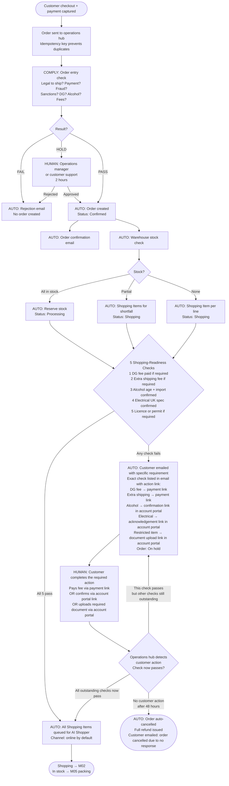
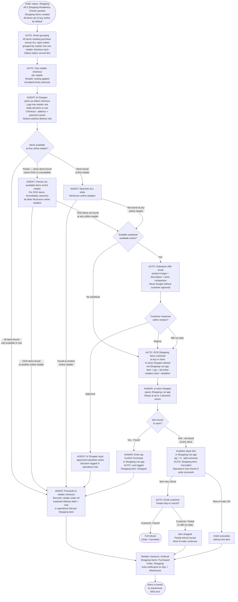
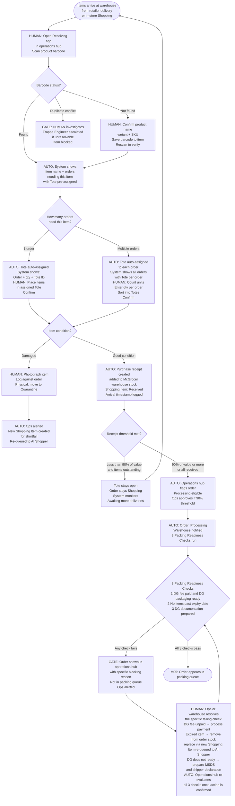
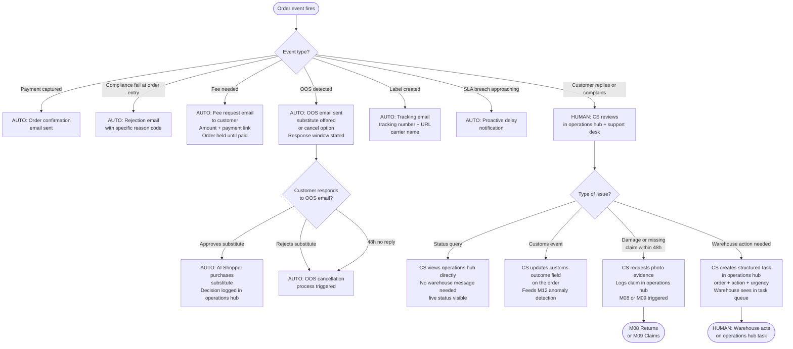
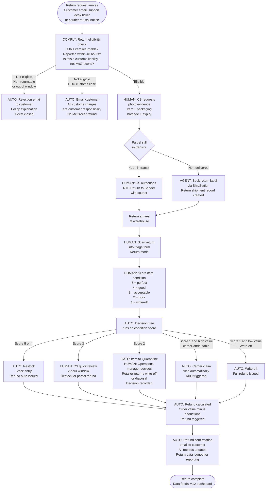
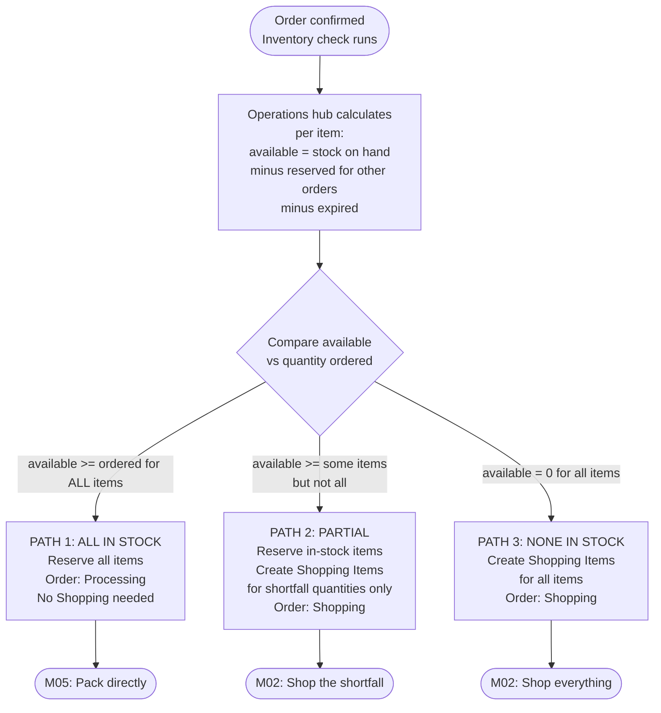

# McGrocer 2.0 — Automated Operations Flow

**Version 2.5 — 2026-06-03**
**Audience:** Everyone who reads this is covered — CEO, CTO, Head of Engineering (HOE), Product Manager, Frappe Engineers, AI Engineers, SEO, Product Designer, Operations, Warehouse, Customer Support, Finance, and Management. It is written so a business reader and an engineer can both read the same step and understand exactly what happens.

> **How this document is written:**
> - **Flowcharts + module text together.** Each flowchart is a clear step-by-step diagram (who acts, what is checked, which branch is taken). Named checks are listed on the diagram where it matters; the module steps and [Checks Register](#checks-register) add the same detail in prose for readers who prefer tables.
> - **Plain ecommerce language first** — the same words Shopify, Amazon, Walmart, and Instacart use for orders, fulfillment, and shipping. We keep a few McGrocer-specific words on purpose: **Shopping**, **Shopper**, **Shopping Item**, **Shopping List**, **Tote**, **Delivery Manifest**.
> - **Acronyms are always spelled out** on first use: DG (Dangerous Goods), HS code (Harmonized System code), DDU (Delivered Duty Unpaid), FDA (U.S. Food and Drug Administration), MSDS (Material Safety Data Sheet), OOS (Out of Stock), QC (Quality Control), FIFO (First In, First Out), RTS (Return to Sender), VAT (Value Added Tax), GST (Goods and Services Tax).
> - When something is stored in our operations system, we say **operations hub**. Frappe Engineers map that to the real ERPNext records and platform components in the **appendix** at the end.
> - **Technical depth is kept where it matters** — this is not a simplified summary. The appendix gives the exact agents, compliance tiers, and QC checkpoints behind each plain-English term, so a Frappe Engineer (with the AI Engineer for AI parts) can build directly from it.

---

## How to Read This Document

Every step is tagged so you know who or what does it:

| Tag | Meaning |
|-----|---------|
| `[AUTO]` | The system does this automatically — no human input |
| `[AGENT]` | An AI agent does this (online checkout, carrier booking, etc.) |
| `[COMPLY]` | **Automated compliance check** — legal/regulatory rules (can we ship? customs codes? return allowed?) |
| `[HUMAN]` | A person must act — **only when the system or agent cannot continue** |
| `[GATE]` | **Hard stop** — nothing moves forward until this is fixed |

> **One rule:** Systems and agents act first. People are the last resort — not the default.

### Document standard — what belongs where

| Layer | Use it for | Do not put here |
|-------|------------|-----------------|
| **Flowchart (per module)** | Sequence of steps, decision branches, who acts (`[AUTO]` / `[AGENT]` / `[HUMAN]` / `[COMPLY]` / `[GATE]`), and the **name** of each check (e.g. "5 Shopping-Readiness Checks" with the five items on one node). | Long policy text, full legal wording, every ERP field name, implementation code. |
| **Module step table** | Exact actions, systems, and data captured per step — the operational spec. | Duplicate the entire flowchart in prose. |
| **[Checks Register](#checks-register)** | Canonical definition of each named check (used once, referenced everywhere). | Steps that only appear in one module and never repeat. |
| **[SLAs & timing](#slas--timing-reference)** | Every deadline in one place. | Ad-hoc timings buried only in narrative. |
| **Appendix** | ERPNext record names, agents, compliance tiers, engineering mapping. | Day-to-day operations language. |

**Flowchart rule:** If a diagram needs more than ~8 words per line or more than ~15 nodes in one chart, split it (e.g. M06 dispatch vs M06 manual carrier fallback) or move detail to the step table.

---

# END-TO-END FLOWCHART — ALL 12 MODULES

## All 12 modules accounted for

Not every module is a discrete step in the order journey. Four are cross-cutting or always-on systems that run alongside the flow:

| Module | Role | Where it appears in the chart |
|--------|------|-------------------------------|
| **M01** — Order Entry & Pre-Validation | Order flow step | Named subgraph — Part 1 |
| **M02** — Shopping & Retailer Checkout | Order flow step | Named subgraph — Part 1 |
| **M03** — Inbound Receiving | Order flow step | Named subgraph — Part 2 |
| **M04** — Warehouse Physical Layout | Physical prerequisite | Zone names (Zone 1, Zone 3, Zone 6) referenced inside M03 and M05 nodes. No flow steps — it defines the space the flow operates in. |
| **M05** — Packing & Fulfillment Record | Order flow step | Named subgraph — Part 3 |
| **M06** — Carrier Booking, Label & Handoff | Order flow step | Named subgraph — Part 4 |
| **M07** — Customer Communication | Order flow step | Named subgraph — Part 5 |
| **M08** — Returns Management | Order flow step | Part of POST-DELIVERY subgraph — Part 5 |
| **M09** — Claims & Carrier Disputes | Order flow step | Part of POST-DELIVERY subgraph — Part 5 |
| **M10** — Inventory & Stock Management | Always-on rules engine | Stock check (3 paths) embedded in M01; expiry automation in M10 · M12 background jobs subgraph |
| **M11** — Compliance, Duties & Customs | Cross-cutting engine | Every `[COMPLY]` node in the chart (M01 order-entry check, M06 pre-label check, M08 return-eligibility check) is M11's engine running |
| **M12** — Operational Intelligence | Always-on monitoring | Daily ops digest and expiry alerts in M10 · M12 background jobs subgraph; SLA metrics recorded at end of M06 |

> **How to read this chart:** This is the complete journey of every McGrocer order — from customer payment to delivery, returns, and daily intelligence. Every decision, every compliance check, every escalation path, and every status change is shown. Nothing is hidden. Every box states what happens, who does it, and what it produces.
>
> **Compliance Engine — 3 tiers, always deterministic.** The `[COMPLY]` tag appears at exactly three points (M01, M06, M08). Each time, the same engine runs: **Tier 1** — YAML rules evaluated in <50 ms from Redis cache. **Tier 2** — LLM classification (Claude API) triggered only on a cache miss, confidence-scored 0–1, result cached if ≥ 0.80. **Tier 3** — Compliance Lead human review queue, 24-hour SLA. No LLM ever decides compliance — it only classifies edge cases for a human to confirm.
>
> **Gated Tool Layer.** All `[AGENT]` actions route through an audited integration layer that holds credentials (HashiCorp Vault), enforces allow-lists, and logs every call. Agents never call a retailer site or carrier API directly.
>
> **Decision Log.** Every AI-assisted decision is written to an append-only log: verbatim intent, tool inputs, tool response, rationale, model/rule version, confidence, actor, and timestamp. Immutable audit trail for compliance and QA.
>
> **Five agents in this flow:**
> | Agent | Role | Modules |
> |-------|------|---------|
> | **Order Review Agent** | Orchestrates order-entry compliance, fraud scoring | M01 |
> | **Sourcing Router — AI Shopper** | Online retailer login, cart, checkout, cost capture | M02 |
> | **Warehouse / QC Agent** | Receiving prompts, Tote assignment, QC gate enforcement | M03, M05 |
> | **Dispatch Agent (AI-010)** | Pre-label compliance, customs docs, carrier booking, label creation | M06 |
> | **Returns Agent (AI-012)** | Return label creation, triage decision execution, refund trigger | M08 |

```mermaid
flowchart TD
    %% ==================== ORDER ENTRY ====================
    subgraph M01["M01 — ORDER ENTRY & PRE-VALIDATION"]
        direction TB
        PAY([Customer pays on McGrocer storefront\nPayment captured before any order is created\nNothing sourced until payment confirmed]) --> CE1[COMPLY: Order-entry compliance check\nTier 1 YAML rules — Redis cache — under 50ms\nTier 2 LLM classification if cache miss — under 3s\nTier 3 Compliance Lead review if confidence below 0.80 — 24hr SLA\nChecks: legal to ship to destination? DG? Alcohol? OTC? Food? Electrical?\nFraud score from Order Review Agent? Sanctions? Fee adequate?]
        CE1 --> CE1R{Compliance result?}
        CE1R -->|FAIL — specific reason code| FAIL1([AUTO: Rejection email to customer\nReason stated in plain English\nNo order created\nPayment refunded automatically])
        CE1R -->|HOLD — Tier 3 queue or fraud flag| HOLD1[HUMAN: Compliance Lead or Ops manager\nalerted with exact flag code\n2-hour resolution SLA]
        HOLD1 -->|Approved| SOCREATE
        HOLD1 -->|Rejected| FAIL1
        CE1R -->|PASS| SOCREATE[AUTO: Sales Order created in operations hub\nPriority score set: perishable first — express second — oldest third\nDG flag set if any item is Dangerous Goods\nIdempotency key prevents duplicate orders on retry]
        SOCREATE --> CONFMAIL[AUTO: Order confirmation email sent to customer\nWithin 2 minutes of payment\nOrder number — itemised list — estimated delivery — tracking portal link]
        SOCREATE --> INVCHECK[AUTO: Stock check per order line\navailable = on-hand minus reserved for other orders minus expired\nRuns against Stores-M warehouse bin]
        INVCHECK --> INVR{Stock result?}
        INVR -->|All items in stock| P1[PATH 1: ALL IN STOCK\nReserve all items\nOrder: Processing\nTote assigned at first scan in M03]
        INVR -->|Partial stock| P2[PATH 2: PARTIAL\nReserve in-stock items\nCreate Shopping Items for shortfall\nOrder: Shopping]
        INVR -->|No stock| P3[PATH 3: NO STOCK\nCreate Shopping Items for all lines\nOrder: Shopping]
        P1 --> ERPVAL{5 Shopping-Readiness Checks — all must pass before any item is bought\n1 DG fee — £87 paid if DG items present — auto-waived for EU / Norway / Switzerland\n2 Extra shipping fee — paid if estimated weight exceeds flat-rate threshold\n3 Alcohol — customer confirmed 18+ AND CE Tier 1 confirms destination permits import\n4 Electrical — customer confirmed UK spec: 3-pin BS1363 plug — 230V — 50Hz\n5 Restricted items — customer uploaded required licence or permit document}
        P2 --> ERPVAL
        P3 --> ERPVAL
        ERPVAL -->|All 5 pass| SHOPASSIGN[AUTO: All Shopping Items queued for Sourcing Router — AI Shopper\nChannel: online by default — in-store only as fallback]
        ERPVAL -->|Any check fails| CE2BLOCK[AUTO: Customer emailed with exact requirement and action link\nDG fee payment link — extra shipping payment link\nalcohol or electrical confirmation link — document upload link\nOrder: On hold]
        CE2BLOCK --> CUSTACT[HUMAN: Customer completes the required action\nPays fee — OR confirms via portal — OR uploads document]
        CUSTACT --> ETERECHECK{Operations hub detects action\nFailing check now passes?}
        ETERECHECK -->|Check passes\nbut other checks still outstanding| CE2BLOCK
        ETERECHECK -->|All 5 checks now pass| SHOPASSIGN
        ETERECHECK -->|No customer action\nafter 48 hours| ETECANCEL([AUTO: Order auto-cancelled\nFull refund issued\nCustomer notified])
    end

    %% ==================== SHOPPING ====================
    subgraph M02["M02 — SHOPPING & RETAILER CHECKOUT"]
        direction TB
        SHOPASSIGN --> AGG[AUTO: Smart grouping\nAll Shopping Items across ALL open orders grouped by retailer\nOne retailer checkout per retailer — not one per order\nOldest orders served first within each group\nKendamil quantity caps enforced per retailer]
        AGG --> AISHOP[AGENT: Sourcing Router — AI Shopper — via Gated Tool Layer\nCredentials from HashiCorp Vault — residential proxy pool active\nPicks up oldest retailer checkout\nLogs in — builds cart — selects earliest delivery slot to warehouse — checks out\nAll inputs and responses written to Decision Log]
        AISHOP --> FOUND{Items available\nat this online retailer?}
        FOUND -->|All items found\nand in cart| ORDERED[AGENT: Records per Shopping Item in operations hub\nretailer order ref — expected delivery date — purchase cost\nShopping Items: Purchased\nDecision Log: intent — tool inputs — response — timestamp]
        FOUND -->|Partial — some found\nsome OOS or unavailable| ETEFOUND[AGENT: Checks out found items at this retailer\nFor OOS items: immediately searches\nall other McGrocer online retailers]
        FOUND -->|None found\nat this retailer| XSEARCH[AGENT: Sourcing Router searches ALL other\nMcGrocer online retailers automatically via Gated Tool Layer]
        ETEFOUND -->|OOS items found\nat another online retailer| ORDERED
        ETEFOUND -->|OOS items not found\nat any online retailer| INSTASK
        XSEARCH -->|Found elsewhere online| ORDERED
        XSEARCH -->|Not found at any online retailer| INSTASK[AUTO: Shopping Item switched to buy in store\nIn-store Shopper alerted via Shopping List app\nAlert includes: item — qty — all online retailers tried — deadline]
        INSTASK --> INSTOR{Item found\nin store?\nUp to 3 physical stores}
        INSTOR -->|Found| INSTBUY[HUMAN: Enters qty — taps Confirm Purchase\nin Shopping List app\nAUTO: cost logged — Shopping Item: Shopped]
        INSTOR -->|N/A — not found at any store| MARKNA[HUMAN: Taps Mark N/A in Shopping List app\nqty = 0 — adds comment listing all stores tried\nAUTO: Shopping Item: Cancelled\nOperations hub assesses if order can proceed]
        MARKNA -->|Rest of order OK| P1BACK[Order proceeds without this item\nPartial refund auto-issued for cancelled item]
        MARKNA -->|Item was critical| CUSTMAIL[AUTO: Email customer two options:\n1 Accept partial shipment — refund for cancelled item — rest ships\n2 Cancel entire order — full refund\n48-hour response window from email send timestamp]
        CUSTMAIL -->|Customer: Cancel| SOCANCEL([AUTO: Full refund issued\nOrder: Cancelled])
        CUSTMAIL -->|Customer: Partial\nor 48h no reply| DROPIT[Item dropped\nPartial refund issued — rest of order continues]
        INSTBUY --> ORDERED
        DROPIT --> ORDERED
        P1BACK --> ORDERED
        ORDERED --> SOSTAT1[AUTO: Order: Shopping\nAll Shopping Items purchased\nOps and warehouse notified with expected delivery dates]
    end

    %% ==================== RECEIVING ====================
    subgraph M03["M03 — INBOUND RECEIVING & VERIFICATION"]
        direction TB
        SOSTAT1 --> ARRIVE([Items arrive at warehouse\nfrom retailer delivery or in-store shopping bag\nAll items held in Inbound Zone 1 — nothing moved until scanned])
        ARRIVE --> SCANUI[HUMAN: Opens Receiving app in operations hub\nScans product barcode with scanner or Shopper PWA camera]
        SCANUI --> BARCODE{Barcode status?}
        BARCODE -->|Found| SHOWORDERS[AUTO: Shows item name — all orders needing this item\nwith Tote pre-assigned to each order]
        BARCODE -->|Not found| NEWBC[HUMAN: Confirms product name and variant\nSaves barcode to item in operations hub\nRescans to verify mapping]
        BARCODE -->|Duplicate conflict| BCBLOCK[GATE: Hard stop — This barcode is already linked to another item\nHUMAN investigates — Frappe Engineer escalated if unresolvable\nItem blocked until resolved]
        NEWBC --> SHOWORDERS
        SHOWORDERS --> HOWMANY{How many orders\nneed this item?}
        HOWMANY -->|1 order| SINGLETOTE[AUTO: Tote auto-assigned by system\nShows: order — qty — Tote ID\nHUMAN: Places items in assigned Tote — taps Confirm]
        HOWMANY -->|Multiple orders| MULTITOTE[AUTO: Tote auto-assigned to each order\nShows all orders with Tote per order\nHUMAN: Counts physical units — enters qty per order\nSorts into each Tote — Confirms\nTotal entered cannot exceed physical units received]
        SINGLETOTE --> ITEMCOND{Item condition\non arrival?}
        MULTITOTE --> ITEMCOND
        ITEMCOND -->|Good condition| POSTED[AUTO: Purchase receipt created\nAdded to McGrocer warehouse stock in Stores-M bin\nShopping Item: Received\nExpiry date logged — Arrival timestamp recorded for SLA measurement]
        ITEMCOND -->|Damaged on arrival| DAMAGED[HUMAN: Photographs damaged item on Shopper PWA\nLogs damage against order and Shopping Item in operations hub\nPhysically moves item to Quarantine Zone 4\nLabels with: order number — date — damage reason\nAUTO: Ops alerted — new Shopping Item created for replacement]
        POSTED --> THRESH{Receipt\nthreshold?}
        THRESH -->|Less than 90% of value\nand items still outstanding| PARTIAL[Tote stays open — Order stays Shopping\nSystem monitors — await next delivery]
        PARTIAL --> ARRIVE
        THRESH -->|90% or more received\nor all non-cancelled items received| RDYPACK[AUTO: Order flagged eligible for packing\nOps manager approves if 90% threshold\nAuto-advances if 100% received\nOrder: Processing — warehouse notified]
        RDYPACK --> ERPVALM3{3 Packing Readiness Checks\n1 DG only: £87 DG fee confirmed paid AND DG packaging materials available at station\n2 All orders: no item has reached or passed its expiry date today\n3 DG only: MSDS and shipper declaration documents prepared}
        ERPVALM3 -->|Any check fails| CE3BLOCK[GATE: Order shown in operations hub\nwith specific blocking reason — Ops alerted\nDG fee unpaid — expired item present — DG docs not ready]
        CE3BLOCK --> RESOLVE3ETE[HUMAN: Ops or warehouse resolves specific issue\nDG fee: process payment\nExpired item: remove from order — new Shopping Item re-queued\nDG docs: prepare MSDS and shipper declaration\nAUTO: Operations hub re-runs all 3 checks when resolved]
        RESOLVE3ETE --> ERPVALM3
        ERPVALM3 -->|All 3 checks pass| PACKQUEUE([Order added to packing queue in priority order\nM05 next])
    end

    %% ==================== PACKING ====================
    subgraph M05["M05 — PACKING & FULFILLMENT RECORD"]
        direction TB
        PACKQUEUE --> PICKORDER[HUMAN: Selects oldest Processing order from packing queue]
        PICKORDER --> SHOWLIST[AUTO: Operations hub shows Tote number and Zone 2 location\nFull checklist: every product name — exact quantity expected — condition notes]
        SHOWLIST --> RETRIEVE[HUMAN: Retrieves items from Tote\nPhysically verifies every item: correct name — correct qty — undamaged]
        RETRIEVE --> ALLITEMS{All checklist items\npresent and undamaged?}
        ALLITEMS -->|Item missing from Tote| MISSINGITEM[GATE: HUMAN flags missing item — Ops alerted\nOrder blocked]
        MISSINGITEM --> FINDM5{Can item\nbe located?}
        FINDM5 -->|Found in warehouse| RETRIEVE
        FINDM5 -->|Cannot be found| RESHOPM5[AUTO: New Shopping Item created\nRe-queued to AI Shopper\nOrder back to Shopping]
        RESHOPM5 --> MSHOPPED([M02: AI Shopper\npurchases replacement])
        ALLITEMS -->|All present| CEFLAGS{Compliance flags\non this order?}
        CEFLAGS -->|DG flag set| DGPACK[GATE: Must tick all three:\n1 UN-compliant DG packaging in use\n2 MSDS at station — ready to attach\n3 Shipper declaration prepared]
        CEFLAGS -->|Alcohol flag set| ALCPACK[GATE: Must confirm both:\n1 Customer 18+ age verification on file\n2 Destination import confirmation on file]
        CEFLAGS -->|Electrical flag set| ELECPACK[Confirms UK spec\nacknowledgement on file]
        CEFLAGS -->|No flags| WRAPSTEP
        DGPACK -->|All three ticked| WRAPSTEP
        ALCPACK -->|Both confirmed| WRAPSTEP
        DGPACK -->|Any missing| BLOCKPACK[Order blocked — Ops alerted\nHUMAN: Sources missing item\ne.g. DG packaging — prepares docs\nAUTO: Block lifts when all ticked]
        BLOCKPACK --> DGPACK
        ALCPACK -->|Either missing| BLOCKPALC[Order blocked — Ops alerted\nHUMAN: Locates missing confirmation\nAUTO: Block lifts when both confirmed]
        BLOCKPALC --> ALCPACK
        ELECPACK --> WRAPSTEP
        WRAPSTEP[HUMAN: Wraps fragile and glass items in bubble wrap per category standard\nHeavy items at base — void fill prevents movement] --> BOXREC[AUTO: Operations hub recommends box size\nSmall — Medium — or Large based on order weight and item count]
        BOXREC --> QC3[HUMAN: 3 QC checks before sealing:\n1 Every checklist item is inside the box\n2 Box weight feels right for the contents\n3 No damage — no leaks — all seals intact]
        QC3 --> PHOTO[HUMAN: Photographs open packed box — all contents clearly visible\nAUTO: Photo uploaded to GCS and attached to order in operations hub\nThis is carrier claim evidence — proves condition at dispatch]
        PHOTO --> SEAL[HUMAN: Seals box — tapes all edges: top — bottom — all four sides — no loose flaps]
        SEAL --> WEIGH[HUMAN: Weighs sealed box — reads actual packed weight\nMeasures L × W × H in cm\nEnters weight in kg and dimensions into operations hub Delivery Note]
        WEIGH --> VOLCALC[AUTO: Volumetric weight check — formula: L × W × H divided by 5000\nCarriers charge whichever is higher: actual or volumetric weight\nIf volumetric exceeds actual: warning shown — consider smaller box to avoid surcharge]
        VOLCALC --> DNCREATE[AUTO: Fulfillment record — Delivery Note — created in operations hub\nItems — weight — dimensions — dispatch address — delivery address saved\nNO carrier label created at this stage]
        DNCREATE --> MOVEDISPATCH[HUMAN: Moves sealed parcel to Dispatch Staging Zone 6\nAUTO: Tote status set to Available — Order: Awaiting shipment]
        MOVEDISPATCH --> CE4PRE{Pre-dispatch checklist:\n1 Delivery Note complete: weight — dimensions — delivery address — dispatch address all present\n2 DG orders only: MSDS and shipper declaration physically on sealed parcel and confirmed in operations hub}
        CE4PRE -->|Any check fails| CE4BLOCK[GATE: Ops alerted with specific reason\nIncomplete data: fill missing fields in operations hub\nDG docs: warehouse associate physically attaches\nMSDS and declaration to parcel — confirms in operations hub]
        CE4BLOCK --> RESOLVE4ETE[HUMAN: Ops or warehouse\nresolves specific issue\nAUTO: Checklist re-evaluated\nwhen confirmed in operations hub]
        RESOLVE4ETE --> CE4PRE
        CE4PRE -->|All clear| DISPATCHQ([AUTO: Dispatch Agent AI-010 triggered\nM06 begins])
    end

    %% ==================== DISPATCH ====================
    subgraph M06["M06 — CARRIER BOOKING, LABEL & HANDOFF"]
        direction TB
        DISPATCHQ --> AISTART[AGENT: Dispatch Agent — AI-010 — via Gated Tool Layer\nPicks up oldest order in Awaiting shipment status]
        AISTART --> DNCHECK[AGENT: Validates Delivery Note in operations hub\nparcel_weight — parcel_length — parcel_width — parcel_height\ndelivery address — dispatch address must be McGrocer-Billing Brentwood CM14 4JE\nIf any field missing: Ops alerted — agent stops]
        DNCHECK --> CECHECK[COMPLY: Pre-label compliance check\nTier 1 YAML rules — Redis cache — under 50ms\nTier 2 LLM if cache miss — Tier 3 Compliance Lead if confidence below 0.80 — 24hr SLA\n1 HS code present on every order line for this destination\n2 Real-time sanctions re-screen on delivery name and address\n3 UK export restrictions satisfied for all items]
        CECHECK -->|Blocked — missing HS code\nor sanctions match found| CEDBLOCK[GATE: Ops alerted with specific reason:\nMissing HS code: Compliance Lead adds to Item master\nSanctions: verify and clear — or cancel order\nExport restriction: verify and clear — or obtain licence]
        CEDBLOCK --> RESOLVE6CE[HUMAN: Compliance Lead or Ops resolves\nthe specific block in operations hub\nAUTO: Dispatch Agent re-runs\npre-label check once resolved]
        RESOLVE6CE --> CECHECK
        CECHECK -->|Cleared| INVOICEGEN[AUTO: Commercial invoice auto-generated from operations hub order data\nEvery item — HS code from Item master — declared value = actual sale price never under-declared\nDDU statement included — stored in GCS with cryptographic hash — 7-year retention]
        INVOICEGEN --> DGSHIP{DG shipment?}
        DGSHIP -->|Yes — DG flag set| DGDOCCHECK[AGENT: Checks operations hub for confirmation that\nMSDS and shipper declaration are physically on sealed parcel\nConfirmation was set by warehouse in M05]
        DGDOCCHECK -->|Not confirmed\nin operations hub| DGBLOCK[GATE: Ops alerted\nLabel creation blocked\nWarehouse must physically attach docs\nand confirm in operations hub]
        DGBLOCK --> RESOLVE6DG[HUMAN: Warehouse associate physically attaches\nMSDS and shipper declaration to sealed parcel\nConfirms in operations hub\nAUTO: Dispatch Agent re-checks confirmation]
        RESOLVE6DG --> DGDOCCHECK
        DGDOCCHECK -->|Confirmed| FDACHECK
        DGSHIP -->|No DG flag| FDACHECK{US food shipment?\nAny food item + destination = United States?}
        FDACHECK -->|Yes — food to USA| FDAGATE[AGENT: Submits FDA Prior Notice to FDA PNSI portal — free US government API\nUS law requires FDA notification before any food shipment enters the country\nHARD GATE: No ShipStation label created until FDA returns a confirmation number\nAuto-retry: 2 minutes — then 5 minutes — then 10 minutes\nNo confirmation after 4 hours: Ops alerted — manual filing required — 4-hour SLA\nfda_confirmation_number recorded on Delivery Note in operations hub]
        FDAGATE -->|FDA confirmation number received| SSAPI
        FDAGATE -->|4 hours — no FDA confirmation| FDABLOCK2[GATE: HUMAN Ops files FDA Prior Notice manually via FDA PNSI portal\nEnters confirmation number into operations hub Delivery Note\nLabel creation resumes]
        FDABLOCK2 --> SSAPI
        FDACHECK -->|Not a US food shipment| SSAPI[AGENT: Requests live carrier rates from ShipStation API v2\nPOST /v2/rates — destination — parcel weight — dimensions — declared value\nShipStation returns available carriers — service levels — prices]
        SSAPI --> RATES{Valid carrier\nrates returned?}
        RATES -->|No valid rates\nno carrier serves destination| MANUALSHIP[GATE: HUMAN Ops alerted immediately\nBooks manually via ShipStation portal OR DHL direct OR World Options\nEnters tracking number — carrier name — cost into operations hub\nReason logged: no rate — cheaper direct — DG route — remote postcode]
        RATES -->|Rates returned| CARRIERSEL[AGENT: Applies carrier selection rules:\nUK mainland standard: cheapest valid rate\nNext-day selected: overnight service regardless of cost\nRemote postcode HS ZE KW IV BT: accept up to £20 surcharge — Ops alert if over\nDG order: DG-compliant carrier route only\nDecision written to Decision Log]
        CARRIERSEL --> CHEAPER{Cheaper valid route\noutside ShipStation?}
        CHEAPER -->|Yes — Ops books direct| MANUALSHIP
        CHEAPER -->|No — ShipStation is optimal| LABELCREATE[AGENT: Creates carrier label via ShipStation API v2\nPOST /v2/labels — this is the ONLY point in the entire flow where a carrier label is created\nShipStation returns: label PDF URL — tracking number — shipstation_label_id]
        LABELCREATE --> TRACKWRITE
        MANUALSHIP --> TRACKWRITE[AUTO: Writes to Delivery Note in operations hub:\ntracking_number — carrier — tracking_url — shipstation_label_id\nOrder: Shipped\ncustoms_outcome set to Pending — CS updates when customs event occurs]
        TRACKWRITE --> CUSTNOTIF[AUTO: Fulfillment notification email sent to customer immediately via Klaviyo\nTracking number — carrier name — tracking URL — estimated delivery window]
        CUSTNOTIF --> APPLYLABEL[HUMAN: Downloads carrier label PDF from operations hub\nPrints and physically applies to correct parcel in Dispatch Staging Zone 6\nScans carrier label barcode to confirm tracking number registered in operations hub]
        APPLYLABEL --> PRESCAN[HUMAN: Pre-dispatch scan QC — scans every label in Zone 6\nCount of scanned labels must equal count of Delivery Notes in Shipped status awaiting collection\nIf any mismatch: find missing parcel before courier arrives]
        PRESCAN -->|Count mismatch| FINDPARCEL[HUMAN: Locates missing parcel\nResolves before courier arrives]
        FINDPARCEL --> PRESCAN
        PRESCAN -->|Count matches| STAGEPARCELS[HUMAN: Stages parcels in Zone 6\ngrouped by carrier and service type]
        STAGEPARCELS --> COURIER[HUMAN: Courier arrives\nCounts parcels — must match Delivery Manifest\nHands over all parcels — gets signed Delivery Manifest from driver\nAUTO: Collection timestamp logged in operations hub]
        COURIER --> SLAMETRIC[AUTO: Daily dispatch SLA recorded\n% of orders eligible by 2 PM cutoff that actually shipped\nReviewed by Ops manager in morning M12 digest]
    end

    %% ==================== CUSTOMER COMMS ====================
    subgraph M07["M07 — CUSTOMER COMMUNICATION & CS INTEGRATION"]
        direction TB
        SLAMETRIC --> CUSTWATCH([Customer received fulfillment notification\nTracking number — tracking URL — carrier name\nOrder: Shipped — parcel in transit to customer])
    end

    %% ==================== POST-DELIVERY ====================
    subgraph POST["POST-DELIVERY — M08 RETURNS · M09 CLAIMS"]
        direction TB
        CUSTWATCH --> DELIVERY([Parcel delivered to customer\nCarrier tracking confirms delivery event])
        DELIVERY --> ISSUE{Issue reported\nwithin 48 hours of\nconfirmed delivery?}
        ISSUE -->|No issues reported| DONE([Order complete\nM12 metrics updated])
        ISSUE -->|Return request\ndamage or missing item| CE5RUN[COMPLY: Return eligibility check\nTier 1 YAML rules — instant result\n1 Is this item type returnable — never: opened food — baby food — infant nutrition\npersonal care — perishables — temp-sensitive — short shelf-life — custom orders\n2 Was the problem reported within 48 hours of confirmed delivery?\n3 Is this a DDU customs liability — customer is Importer of Record — not McGrocer]
        CE5RUN -->|Non-returnable item type\nor outside 48-hour window| RETURNREJ[AUTO: Rejection email to customer\nSpecific reason stated — relevant policy quoted\nCase logged and closed in operations hub]
        CE5RUN -->|DDU customs case\nparcel refused or held by customs| DDURESP[AUTO: Email customer\nYou are Importer of Record under McGrocer DDU shipping model\nAll customs charges and return costs are your responsibility\nThis was stated at checkout and in prior emails]
        CE5RUN -->|Eligible — parcel still in transit| RTS[HUMAN: CS authorises Return to Sender with courier directly\nRTS logged in operations hub against Delivery Note]
        CE5RUN -->|Eligible — parcel delivered| REVLOG[AGENT: Returns Agent — AI-012 — via Gated Tool Layer\nBooks return label via ShipStation — USA alternative: Shippo if needed\nReturn Delivery Note created in operations hub\nDecision written to Decision Log]
        RTS --> RETARRIVES[Return arrives at warehouse\nMoved to Returns Zone — Zone 5\nNever mixed with active stock under any circumstances]
        REVLOG --> RETARRIVES
        RETARRIVES --> SCANTRIAGE[HUMAN: Scans return into operations hub triage form\nReturn mode of Receiving app\nScores item condition on 1 to 5 scale]
        SCANTRIAGE --> CE5TREE[AUTO: Decision tree runs on condition score\n5 = perfect as new — 4 = good minor packaging issue\n3 = acceptable damaged packaging only\n2 = poor product itself damaged — 1 = write-off]
        CE5TREE -->|Score 5 or 4| RESTOCK[AUTO: Stock Entry created — item restocked\nRefund auto-triggered]
        CE5TREE -->|Score 3| CSQUICK[HUMAN: CS quick review — 2-hour SLA\nDecides: restock with full refund OR partial refund and dispose\nDecision recorded in operations hub]
        CE5TREE -->|Score 2| QUARANT[GATE: Item moved to Quarantine Zone 4\nHUMAN: Ops manager decides:\nretailer return for credit — write-off at cost — or disposal\nDecision based on item value and recoverability — recorded in operations hub]
        CE5TREE -->|Score 1 and high value\ncarrier-attributable damage| M09CLAIM[AUTO: Carrier claim filed automatically\nPre-filled from operations hub:\ncustomer details — order — item values — tracking — M05 packing photo as primary evidence\nCS adds customer damage photos — submits to carrier claims portal\n60-day UPS deadline tracked — alert raised at 14 days remaining]
        CE5TREE -->|Score 1 and low value\nbelow write-off threshold| WRITEOFF[AUTO: Write-off entry created\nFull refund auto-issued]
        RESTOCK --> REFUNDCALC[AUTO: Refund calculated:\norder value minus deductions — return shipping — customs fees if applicable — handling\nRefund triggered to Stripe or PayPal]
        CSQUICK --> REFUNDCALC
        QUARANT --> REFUNDCALC
        WRITEOFF --> REFUNDCALC
        M09CLAIM --> CLAIMPROCESS[AUTO: Carrier claim tracked in operations hub:\nStatus: submitted — under review — approved or rejected or closed\n60-day UPS window monitored — alert when fewer than 14 days remain\nPattern detection: more than 2 incidents on same SKU — route — or carrier in one month flags investigation]
        REFUNDCALC --> REFUNDMAIL[AUTO: Refund confirmation email sent to customer\nExact amount — itemised deductions — expected credit timeline\nAll return records updated in operations hub]
        REFUNDMAIL --> DONE
        CLAIMPROCESS --> DONE
    end

    %% ==================== DAILY BACKGROUND JOBS ====================
    subgraph BACKGROUND["M10 · M12 — INVENTORY, INTELLIGENCE & DAILY OPS"]
        direction LR
        DAILYJOB([Daily 6 AM scheduled job\noperations hub]) --> EXP7[Items expiring within 7 days:\nAlert to Warehouse + Ops with item name and quantity]
        DAILYJOB --> EXPTODAY[Items expired today:\nAuto-removed from available stock in Stores-M bin\nOps alerted — blocked from new order allocation]
        DIGIJOB([8:30 AM daily ops digest]) --> DIGIOUT[Auto-sent to Ops manager:\nOrders by status — yesterday dispatch SLA %\nOpen exceptions count — returns awaiting triage\nCustoms holds outstanding]
    end
```

---

## Order status — the only list to memorise

These are the **customer-facing order statuses** used everywhere in this document (aligned with common ecommerce platforms):

| Status | Plain English | Typical trigger |
|--------|---------------|-----------------|
| **Confirmed** | Customer paid; order accepted; compliance passed | After M01 pass |
| **Shopping** | We are buying the order's items from UK retailers (online or in-store) | Shopping Items created |
| **Processing** | Items are at the hub: receiving, sorting into Totes, packing | Receiving started or all stock already on hand |
| **Awaiting shipment** | Order packed and weighed; parcel in dispatch staging; **carrier label not created yet** | End of M05 |
| **Shipped** | Carrier label created; tracking number sent to customer; parcel handed to courier (or in transit) | End of M06 |
| **Delivered** | Carrier confirms delivery to the customer | Tracking = delivered |
| **Cancelled** | Order cancelled; refund issued where applicable | Customer or ops decision |
| **On hold** | Waiting on customer payment, compliance review, or ops decision | Any blocking `[GATE]` |

---

## Key terms — ecommerce language

| Term | What it means (like Shopify / Amazon, plus McGrocer-specific words we keep) |
|------|----------------------------------------|
| **Storefront** | McGrocer website — browse, Cart, checkout, pay (replaces Shopify) |
| **Order** | The customer's purchase — one checkout, one delivery address |
| **Order line** | One product on the order (SKU, quantity, price) |
| **Cart** | What the customer builds before checkout (one canonical word — never "basket") |
| **Checkout** | Customer enters address, sees shipping cost, pays — **payment is captured before the order is accepted** |
| **Order confirmation** | Email sent right after payment: "We received your order" |
| **Available stock** | Quantity already in our warehouse, ready to allocate to orders |
| **Shopping** | The order status while we are **buying** the order's items from UK retailers |
| **Shopping Item** | One order line we must **buy from a UK retailer** (not in warehouse stock) — tracks retailer, qty, cost, status |
| **Shopper** | Whoever buys the item: **AI Shopper** (the agent that checks out online) or **In-store Shopper** (a person buying in a physical store) |
| **Shopping List** | The mobile app (`/shopping-list`) that shows the In-store Shopper which Shopping Items to buy and where |
| **Retailer checkout** | One combined purchase at a retailer (e.g. one Tesco order for items from many customer orders) |
| **Out of Stock (OOS)** | Product not available at the retailer — triggers a substitute offer, or a cancel / partial-ship path |
| **Substitute** | Replacement product offered to the customer — **must be approved before we buy it** |
| **Tote** | Physical container in the hub holding **one order's items** — the operations hub assigns the Tote; staff never pick a random one |
| **Receiving** | Scanning items when they arrive at the hub from retailers or in-store Shopping |
| **Packing** | Putting order items in a box: QC (Quality Control), photo, weigh, measure |
| **Fulfillment record** | System record of the packed parcel (weight, dimensions, items, addresses) — created when packing is submitted |
| **Dispatch staging** | Area where **labelled** parcels wait for the courier — no unlabelled boxes |
| **Carrier label** | Shipping label with tracking barcode — **booked in M06** (usually via ShipStation; sometimes via DHL direct, World Options, or another courier portal when cheaper — see M06). Never created at packing. |
| **Tracking number** | Carrier tracking ID emailed to the customer |
| **Fulfillment notification** | "Your order has shipped" email with tracking link |
| **Delivery Manifest** | The collection sheet the courier driver signs when they take the parcels — proof of handover, with collection time |
| **Return** | Customer sends product back — eligibility rules apply |
| **Refund** | Money returned to the customer (full or partial) |
| **Dangerous Goods (DG)** | Hazardous items — special packaging, £87 fee (waived for EU / Norway / Switzerland), DG-capable carrier |
| **HS code (Harmonized System code)** | Customs product classification code — required before any international shipment |
| **DDU (Delivered Duty Unpaid)** | The customer pays import duties/taxes at the destination — stated at checkout |
| **Commercial invoice** | Customs document listing items and declared values |
| **FDA (U.S. Food and Drug Administration) Prior Notice** | US food shipments — the FDA must confirm before any carrier label is printed |
| **Customs outcome** | Cleared · Held · Duty adjusted · Returned · Seized — updated by customer support when known |
| **Gated tool layer** | The audited integration layer the AI Shopper and Dispatch agent act through — they never call a retailer or carrier directly (see appendix) |
| **Decision log** | Append-only record of every AI decision (intent, inputs, result, rule/model version, confidence) — the audit trail (see appendix) |

---

## Alignment — CEO benchmark & platform architecture

This flow is the **completed “Proposed Process”** from the CEO Fulfilment Operations Benchmark (June 2026) and matches the **McGrocer Agentic Platform (ARCH-001)** programme.

| Source | What this document delivers |
|--------|----------------------------|
| **CEO benchmark (M01–M12)** | Best-practice targets: pay-before-shop, compliance at order entry, structured Shopping, receiving, packing, ship, returns, metrics |
| **ARCH-001 / storefront** | Payment before order acceptance · idempotent order submit · automated emails · ShipStation-first dispatch (with manual carrier fallback) · FDA gate for US food |
| **360° architecture** | Storefront → operations hub → Shopping (online + in-store) → hub QC (Quality Control) → carrier — compliance checks at order entry, pre-label, and return |

**Intentional improvements vs old manual flow:** No payment after Shopping · no ChatGPT copy-paste compliance · no Slack for order status (operations hub is live) · online Shopping first, in-store only as backup · every AI action runs through a gated tool layer with an append-only decision log.

**For Frappe Engineers only:** Record names (Sales Order, Shopping Item, Delivery Note, etc.) are listed in the appendix — not used in day-to-day operations language.

---

## Automated compliance — three checks only

Legal and regulatory decisions run in **one compliance service** at three moments. Everything else (fee paid? photo uploaded? weight entered?) is a normal **system checklist**, built by the Frappe Engineer into the operations hub.

| When | What is decided |
|------|-----------------|
| **Order entry (M01)** — after payment, before order is **Confirmed** | Can we legally ship to this country? Payment valid? Fraud/duplicate/sanctions? DG (Dangerous Goods)/alcohol/OTC (over-the-counter medication)/food/electrical rules? Shipping charge adequate? |
| **Pre-label (M06)** — before **carrier label** is created | HS codes (Harmonized System codes) for destination? Final sanctions check? UK export restrictions? |
| **Return (M08)** — when customer requests return | Return allowed? Within 48h reporting window? Customs refusal (customer liability under DDU)? |

| | Owner | Role |
|---|--------|------|
| **Compliance checks** | Frappe Engineer in collaboration with AI Engineer | Law and customs — pass, fail, or hold |
| **System checklists** | Frappe Engineer | Operational yes/no — fee paid, fields complete, docs attached |

---

## Systems — what talks to what

| System | Role in ecommerce terms |
|--------|-------------------------|
| **McGrocer storefront** | Shop, Cart, checkout, pay — replaces Shopify |
| **Operations hub** | Single source of truth for orders, stock, Shopping, packing, tracking, returns (operations hub backend) |
| **Compliance service** | Three automated compliance checks above |
| **Gated tool layer** | The audited boundary every AI agent acts through — retailer logins, carrier APIs, payments. Agents never call a retailer or carrier directly; every call is logged and reversible |
| **AI Shopper** | Online retailer login, Cart, checkout — records retailer order number and cost. Acts only through the gated tool layer |
| **Carrier platform (ShipStation)** | Default path: rates, labels, tracking — used by the Dispatch agent for most shipments |
| **Alternate carrier channels** | **DHL direct**, **World Options**, and other courier portals/sites — used by Operations when ShipStation has no suitable rate or a direct booking is cheaper (manual booking + tracking entered in the operations hub) |
| **Dispatch agent** | Books carrier via ShipStation when rates are valid; selects cheapest valid service per rules. Acts through the gated tool layer |
| **Customer notifications** | Order confirmed, OOS (Out of Stock), tracking, refund — template emails/SMS from operations hub |
| **Support desk (Freshdesk)** | Customer conversations; agents read **live order status** in operations hub |
| **Shopping List app** | `/shopping-list` — mobile list of Shopping Items for the In-store Shopper when online Shopping failed |
| **FDA portal (US food)** | FDA (U.S. Food and Drug Administration) Prior Notice — label blocked until the FDA confirms |

---

## People & roles

| Role | When involved |
|------|----------------|
| **Customer** | Checkout, approve substitutes/fees, report issues within 48h |
| **Customer support** | Replies, returns, claims, updates customs outcome |
| **Operations manager** | Compliance hold, fee exceptions, sanctions, partial-ship approval, dispatch blocks |
| **Warehouse associate** | Receiving scans, packing, apply label after M06, courier handoff |
| **In-store Shopper** | In-store buying only after all online retailers are exhausted — uses the Shopping List app (in practice a warehouse associate stepping into this role) |
| **AI Shopper (agent)** | All online retailer purchases, via the gated tool layer |
| **Dispatch agent (agent)** | Carrier booking and label creation, via the gated tool layer |
| **Frappe Engineer** | Barcode conflicts, system checklists, operational configuration in the operations hub |
| **Frappe Engineer + AI Engineer** | Compliance engine, the agents, decision log, and human-in-the-loop thresholds (AI work is built jointly) |

---

## Checks Register

Every named check used anywhere in this document is defined **once, here** — but the flowcharts also spell each check out inline, so you never have to leave the diagram. When a module says "the 5 Shopping-Readiness Checks" or "the 3 QC (Quality Control) checks", these are the exact items — no module re-lists them differently.

> **Two kinds of check:** a **Compliance check** is a legal/regulatory decision made by the compliance service (result: pass / fail / hold). An **operational check** is a yes/no the operations hub enforces (fee paid? field complete? document attached?).

### Order-entry compliance check (M01) — *compliance*
Runs immediately after payment, before the order is **Confirmed**:
1. Can we legally ship every item to this destination?
2. Any prohibited categories for this destination?
3. DG / alcohol / OTC medication / food / electrical rules satisfied?
4. Payment confirmed and valid?
5. Fraud or duplicate-order check clear?
6. Sanctions screening clear?
7. Does the shipping charge cover the estimated carrier cost?

→ **Fail** = rejection email, no order created. **Hold** = 2-hour human review. **Pass** = order **Confirmed**.

### 5 Shopping-Readiness Checks (M01) — *operational*
All must pass before any item is bought (before the order can move into **Shopping**):
1. **DG fee** — £87 Dangerous Goods (DG) handling fee paid if the order contains DG (automatically waived for EU / Norway / Switzerland).
2. **Extra shipping fee** — paid if the order's weight exceeded the checkout estimate.
3. **Alcohol** — customer age verification **and** destination import confirmation on file.
4. **Electrical** — customer's UK-specification acknowledgement on file.
5. **Licence / permit** — confirmation on file if the item requires one.

→ Any fail = customer emailed the specific requirement; order **On hold** until resolved.

### 3 Packing Readiness Checks (M03) — *operational*
Run before the order can enter the packing queue:
1. **DG orders only:** £87 DG fee confirmed paid **and** DG packaging materials ready.
2. **All orders:** no item has passed its expiry date (any expired item is blocked and Ops alerted).
3. **DG orders only:** DG documentation (safety data sheet + shipper's declaration) prepared.

→ Any fail = order blocked from the packing queue with a specific reason.

### Compliance packing ticks (M05) — *operational*
Confirmed by the associate at the packing station, by order type:
- **DG:** UN-compliant packaging in use · Material Safety Data Sheet (MSDS) ready · shipper's declaration prepared.
- **Alcohol:** customer age verification + destination import confirmation on file.
- **Electrical:** customer's UK-specification acknowledgement on file.

→ Any missing item = packing blocked.

### 3 QC checks before sealing (M05) — *operational*
1. Are all checklist items inside the box?
2. Does the box weight look right for the contents?
3. Is everything undamaged, with no leaks?

### Pre-dispatch checklist (M05) — *operational*
1. Parcel data complete (weight, dimensions, addresses).
2. DG documents physically on the parcel (DG orders only).

→ Fail = operations manager alerted. Pass = dispatch agent starts M06.

### Pre-label compliance check (M06) — *compliance*
Runs before the carrier label is created:
1. HS code present on every line for the destination.
2. Real-time sanctions re-check still clear.
3. UK export restrictions satisfied.

→ Missing HS code or a match = dispatch blocked, operations manager alerted.

### Return eligibility check (M08) — *compliance*
Three checks; all must pass for a return to proceed:
1. **Returnable item?** Never returnable: opened food, baby food, infant nutrition, personal care/hygiene, perishables, temperature-sensitive items, short shelf-life products, custom orders, customer-requested specialist products.
2. **Within 48 hours of confirmed delivery?** Clock starts when tracking shows delivered.
3. **Customs liability?** If refused/held at customs, the customer (Importer of Record under DDU — Delivered Duty Unpaid) bears the cost — not McGrocer.

### Return condition scale (M08) — *operational, 5-point*
| Score | Condition | Automatic decision |
|-------|-----------|--------------------|
| 5 | Perfect — as new | Restock → refund auto-issued |
| 4 | Good — minor packaging issue | Restock → refund auto-issued |
| 3 | Acceptable — damaged packaging only | CS quick review (2h) → restock or partial refund |
| 2 | Poor — product damaged | Quarantine → operations manager decision |
| 1 + high value | Write-off — carrier-attributable | Carrier claim filed automatically (M09) |
| 1 + low value | Write-off — below threshold | Write-off → full refund auto-issued |

---

## SLAs & timing reference

Every time window mentioned anywhere in this document, in one place. No timing is implied — if a step references a deadline, it is listed here.

| Timing | Value | Where it applies |
|--------|-------|------------------|
| Compliance **On hold** review window | 2 hours | M01 — operations manager/CS resolves a held order |
| Order fulfilment commitment | 1–3 business days | End-to-end SLA (M12 SLA tracker) |
| Shopping Item stuck alert | Pending > 24 hours | M12 alert to operations manager |
| Customer no-reply on OOS / substitute offer | 48 hours → item dropped, partial refund | M02 / M07 |
| Return reporting window | 48 hours from confirmed delivery | M08 return eligibility |
| Score-3 return CS quick review | 2 hours | M08 triage |
| FDA Prior Notice confirmation timeout | 4 hours (retries after 2, 5, 10 minutes) | M06 — then manual filing |
| Dispatch cutoff | 2 PM daily | M06 — daily dispatch SLA basis |
| Dispatch cutoff risk alert | 1:30 PM (unpacked eligible orders) | M12 alert to warehouse |
| Expiry pre-alert | 7 days before expiry | M03 / M10 daily job |
| Expiry removal job | Daily 6 AM | M03 / M10 — expired stock removed |
| Daily ops digest | 8:30 AM | M12 — emailed to operations manager |
| SLA-breach early warning | 12 hours before deadline | M12 alert |
| Cycle-count discrepancy investigation | Within 24 hours (if > 5 units) | M10 |
| Slow-mover review | Items held > 30 days, reviewed monthly | M10 |
| Weekly cycle count | Weekly | M10 |
| UPS carrier claim window | 60 days from shipment (alert when < 14 days remain) | M09 |
| Repeat-incident pattern flag | > 2 incidents/month (same SKU, route, or carrier) | M09 / M12 |

---

## M01 — Checkout, payment & order acceptance

### Objective

Every order that enters the fulfillment queue has already been validated for compliance, valid payment, and operational feasibility **before a single item is sourced** — zero post-packing compliance failures, and no goods bought on unconfirmed payment.

### What this module does

The customer pays at checkout. **Immediately after payment**, an automated **compliance check** runs (seconds): Can we ship this order? Is payment valid? Are there fraud or sanctions issues? If it passes, the order becomes **Confirmed** and the customer gets an order confirmation email. If it fails, they get a clear rejection email and **no order is created**. Standard orders need no human touch.

### What starts this module

Customer completes checkout on the storefront — **payment captured before the order is accepted** (same standard as Shopify: pay first, then fulfill).

### Storefront checkout — what the customer confirms (mcgrocer.com Cart / checkout)

These messages appear on the Cart and checkout pages today. McGrocer 2.0 **automates enforcement** of the same rules in the compliance service and operations hub (not copy-paste in ChatGPT).

| Checkout topic | What the customer sees / agrees | How McGrocer 2.0 enforces it |
|----------------|----------------------------------|------------------------------|
| **Destination** | Ships to 150+ countries; import rules vary for food, baby, personal care | Order-entry compliance check (M01) |
| **Import requirements** | Customer confirms items are permitted for personal import; will comply with local laws; is **Importer of Record** | M01 compliance + DDU (Delivered Duty Unpaid) on invoice and emails |
| **Duties & taxes** | Import duties, VAT/GST, customs fees **not** in order total; payable at destination | Landed-cost estimate at checkout (Zonos); DDU on commercial invoice (M06) |
| **Customs inspections** | May be inspected; delays outside McGrocer control | `customs outcome` field (M06/M07/M12) |
| **Refused shipments** | If refused/returned/destroyed: shipping non-refundable; return fees may apply; confiscation may not be refundable | Return-eligibility check (M08) — DDU customs liability branch |
| **Alcohol** | Age verification may be required | Shopping-Readiness Check #3 + packing ticks (M01/M05) |
| **Dangerous Goods** | Special documentation; £87 courier handling fee may apply | DG flag, fee check, packing, DG-capable carrier (M01–M06) |
| **Electrical** | UK specification 220–240V, UK plugs | Shopping-Readiness Check #4 + packing tick (M01/M05) |
| **Shelf-stable only** | Ambient goods only — **no refrigerated or frozen** | Product/catalog rules + compliance categories (M01) |
| **Order changes** | Once Shopping has begun, order **cannot be modified or cancelled** (per shipping policy) | Status **Shopping** locks changes; cancel only via defined OOS/partial-ship paths (M02/M07) |

Full legal text: Shipping Policy and Terms and Conditions (linked from checkout).

### Step-by-step

| # | Step | Owner | System | Data captured |
|---|------|-------|--------|---------------|
| 1 | Customer completes **checkout**. **Payment is captured** before the order is accepted into the operations hub. Nothing is ever sourced before payment clears. | `[AUTO]` | Storefront | Payment captured (amount, method, payment reference) |
| 2 | Order payload sent to operations hub: order lines, quantities, shipping address, payment confirmation. A unique **idempotency key** (a one-time ID attached to the order) means that if the message is sent twice, only one order is ever created — no duplicates on retry. | `[AUTO]` | Storefront → operations hub | Order payload + idempotency key received |
| 3 | **Compliance check (order entry)** runs: legal to ship to destination? Prohibited categories? DG, alcohol, OTC, food, electrical rules? Payment confirmed? Fraud/duplicate? Sanctions? Shipping charge covers estimated carrier cost? See the [Checks Register](#checks-register) for the full list. | `[COMPLY]` | Compliance service | Compliance result: pass / fail / hold + reason code |
| 4 | **Fail** → Customer emailed the specific reason (e.g. "we cannot ship this item to your country"). Order rejected. No order record is created. | `[AUTO]` | Compliance service → customer notifications | Rejection logged (reason code); no order created |
| 5 | **Hold** → Edge case the system cannot decide alone. **Operations manager** or **customer support** reviews within the **2-hour** hold window (see [SLAs & timing](#slas--timing-reference)). | `[HUMAN]` | Operations hub | Order status: **On hold** + hold reason |
| 6 | **Pass** → Order created. Status: **Confirmed**. | `[AUTO]` | Operations hub | Order created; status **Confirmed** |
| 7 | **Priority score** set so queues are worked in the right order. The score combines, in this order: (1) perishable urgency (shorter shelf-life first), (2) express shipping selected at checkout, (3) order age (oldest first). | `[AUTO]` | Operations hub | Priority score on order |
| 8 | **Order confirmation** email sent ("We received your order"). | `[AUTO]` | Customer notifications | Confirmation email sent |
| 9 | If the order contains dangerous goods (DG), the whole order is flagged **DG** so every later step (fee, packing, carrier) applies the DG rules. | `[AUTO]` | Operations hub | DG flag set (if applicable) |
| 10 | **Inventory check** — for each order line, compare quantity ordered against **available stock** (in warehouse, minus already reserved, minus expired). | `[AUTO]` | Operations hub | Available-vs-ordered result per line |
| 11 | **All lines in stock** → reserve the stock. Status: **Processing** (Shopping is skipped). The Tote is assigned at the first receiving scan in M03. | `[AUTO]` | Operations hub | Stock reserved; status **Processing** |
| 12 | **Partial stock** → reserve the available quantity; create one **Shopping Item** for each shortfall quantity. Status: **Shopping**. | `[AUTO]` | Operations hub | Shopping Items created (shortfall only); status **Shopping** |
| 13 | **No stock** → create a Shopping Item for every order line. Status: **Shopping**. | `[AUTO]` | Operations hub | Shopping Items created (all lines); status **Shopping** |
| 14 | Every Shopping Item defaults to **online** retailer purchase and is queued for the AI Shopper. In-store is only used later if online fails (M02). | `[AUTO]` | Operations hub | Shopping Items queued: buy online |
| 15 | **5 Shopping-Readiness Checks** — all must pass before any item is bought. The exact 5 are defined once in the [Checks Register](#checks-register): (1) DG (Dangerous Goods) £87 fee paid if required (waived for EU / Norway / Switzerland), (2) extra shipping fee paid if the order's weight exceeded the checkout estimate, (3) alcohol age + destination import confirmation on file, (4) electrical UK-specification acknowledgement on file, (5) licence/permit confirmation on file if the item requires one. Any fail → customer emailed the specific requirement → order **On hold** until resolved. | `[AUTO]` | Operations hub → customer notifications | Each check pass/fail recorded; Shopping released only when all 5 pass |

### Human escalation

| Situation | Who | Time |
|-----------|-----|------|
| Compliance hold | Operations manager | 2 hours |
| Shipping fee exception | Operations manager | 2 hours |
| Duplicate order | Customer support | 4 hours |
| Customer disputes rejection | Customer support | 24 hours |

### M01 Flowchart



---

## M02 — Shopping & retailer checkout

### Objective

Every item not held in stock is bought from the right retailer at the right price with the right approval chain — full cost capture, structured substitution handling, and no open-ended Shopper decisions. Every online purchase runs through the **gated tool layer** (the AI Shopper never touches a retailer site directly) and every decision is written to the **append-only decision log**.

### What this module does

When items are not in **available stock**, we **shop** for them at UK retailers (like Instacart shopping). The **AI Shopper** checks out online — one **retailer checkout** per store for many customer orders. If an item is **Out of Stock (OOS)** online everywhere, an **In-store Shopper** uses the **Shopping List app** (up to 3 stores).

### What starts this module

Status **Shopping**; all **5 Shopping-Readiness Checks** from M01 passed (see [Checks Register](#checks-register)).

### Shopping Item — What It Tracks

Every item that needs to be bought externally gets its own record (a **Shopping Item**) in the operations hub. This record tracks the entire life of that purchase:

| Information | What It Records |
|-------------|----------------|
| Which order | Which Order this item belongs to |
| What to buy | The specific product and quantity needed |
| Where to buy | Which retailer has been assigned |
| How to buy | Online (AI Shopper) or in-store (In-store Shopper) |
| Status | Waiting → Bought → Received at warehouse → or Cancelled |
| Retailer confirmation | The order reference number from the retailer's website |
| Expected arrival | When the retailer says the item will be delivered |
| What it cost | The actual purchase price — captured when the AI Shopper checks out |

### Step-by-Step

| # | Step | Owner | System | Data captured |
|---|------|-------|--------|---------------|
| 1 | All **5 Shopping-Readiness Checks** are confirmed passed. Every Shopping Item on this order is cleared for purchasing. | `[AUTO]` | Operations hub | Shopping Items cleared to buy |
| 2 | **Smart grouping:** the operations hub looks at ALL open orders across all customers that need items bought, and groups Shopping Items by retailer — all Tesco items across all orders into one Tesco retailer checkout, all Sainsbury's items into one Sainsbury's checkout, and so on. One checkout per retailer, not one per order. | `[AUTO]` | Operations hub | One retailer checkout created per retailer |
| 3 | **Oldest orders first:** within each retailer group, the oldest orders (placed earliest) are bought first, so no customer waits longer just because they ordered later. | `[AUTO]` | Operations hub | Purchase order within group set (oldest first) |
| 4 | Each Shopping Item is assigned to the most suitable retailer based on availability, price, and purchase limits. Priority order: main supermarkets first (Tesco, Sainsbury's, Waitrose, Boots) → specialist retailers second → Amazon only as a last resort. | `[AUTO]` | Operations hub | Retailer assigned to each Shopping Item |
| 5 | **Kendamil baby formula limits:** because Kendamil has strict retailer purchase limits, the system automatically caps quantities — Sainsbury's and Boots: max 10 units per session; Tesco and Waitrose: max 6 units per session; Superdrug: varies by store. Anything above the cap is automatically scheduled for the next retailer checkout. | `[AUTO]` | Operations hub | Quantities capped per retailer rule; overflow re-scheduled |
| 6 | The AI Shopper picks up the oldest retailer checkout and begins purchasing, acting through the gated tool layer (never the retailer site directly). | `[AGENT]` | AI Shopper → gated tool layer | Checkout session started |
| 7 | The AI Shopper logs into the retailer's website using securely stored credentials held in the gated tool layer. | `[AGENT]` | AI Shopper → gated tool layer | Logged in |
| 8 | The AI Shopper adds all required items (combined quantities for all orders needing them) to the Cart. | `[AGENT]` | AI Shopper | Retailer Cart built |
| 9 | **Spend-cap check (human-in-the-loop):** if the retailer Cart total exceeds the configured per-checkout spend cap, the AI Shopper pauses and the operations manager must approve before checkout continues. | `[AGENT]` pause; `[HUMAN]` approve | AI Shopper → operations hub | Approval recorded if over cap |
| 10 | The AI Shopper checks out: the McGrocer delivery address is pre-saved, payment is pre-saved, and the earliest available delivery slot to the warehouse is selected. | `[AGENT]` | AI Shopper → gated tool layer | Order placed with retailer |
| 11 | The AI Shopper records, against each Shopping Item, the retailer's order confirmation number, the expected delivery date, and the actual purchase cost. The Shopping Items are marked **Purchased**. Every input and response is written to the decision log. | `[AGENT]` | AI Shopper → operations hub | Retailer order ref + expected delivery + cost; items **Purchased**; decision logged |
| 12 | Once all Shopping Items for an order are purchased, the order stays at status **Shopping** (everything is ordered and now in transit to the warehouse). Operations and warehouse are notified automatically. | `[AUTO]` | Operations hub → customer notifications | Status confirmed **Shopping**; Ops + warehouse notified |
| 13 | **If the AI Shopper cannot find an item at any online retailer:** the In-store Shopper is automatically alerted in the Shopping List app, and the item is switched from "buy online" to "buy in store". The alert shows: which item, how many are needed, which online retailers were already tried, and the purchase deadline. | `[AUTO]` | Operations hub → Shopping List app | Shopping Item switched to in-store; alert raised |
| 14 | The In-store Shopper opens the Shopping List app on their phone and sees all items that need to be physically bought. They search at up to 3 physical stores. | `[HUMAN]` | Shopping List app | Items to buy shown to the In-store Shopper |
| 15 | **Item found in store:** the In-store Shopper enters the quantity bought and confirms the purchase in the app; the cost is recorded; the Shopping Item is marked **Shopped**. | `[HUMAN]` | Shopping List app → operations hub | Quantity + cost recorded; item **Shopped** |
| 16 | **Item not found in any store:** the In-store Shopper marks the item **N/A** in the app (quantity 0, with a comment listing which stores were tried). The Shopping Item is **Cancelled**, and the operations hub automatically checks whether the rest of the order can still proceed to packing without this item. | `[HUMAN]` mark; `[AUTO]` check | Shopping List app → operations hub | Item **Cancelled**; order proceed/hold assessed |
| 17 | When all purchasing for an order is complete, Operations and the warehouse team are automatically notified with the expected delivery date. | `[AUTO]` | Operations hub → customer notifications | Ops + warehouse notified with expected delivery |

### OOS Escalation Chain

All items start online. In-store is the escalation path — only reached when the AI agent has exhausted all online options.

```
Item not at original online retailer
    ↓
[AGENT] AI Shopper searches ALL other McGrocer online retailers automatically (via the gated tool layer)
    ↓ Found online elsewhere → add to that retailer's checkout → purchase → continue
    ↓ Not found at any online retailer
    ↓
[AUTO] Shopping Item switched to "buy in store"
       In-store Shopper alerted via the Shopping List app: item · qty · all online retailers tried · deadline
    ↓
[HUMAN] In-store Shopper shops at up to 3 physical stores
    ↓ Item found → enter qty in the Shopping List app → confirm purchase → cost logged → continue
    ↓ Item not found at any store → mark N/A in the app (qty = 0, add comment)
    ↓
[AUTO] Shopping Item: Cancelled (N/A)
       Operations hub checks if the rest of the order can proceed
    ↓ Rest of order OK → proceeds to packing
    ↓ Item was critical → customer emailed: "Partial ship or cancel?" (approved template)
    ↓ Customer: Cancel → full refund issued · Order: Cancelled
    ↓ Customer: Partial OR 48h no reply → item dropped · partial refund · rest continues
```

### Substitute Approval Flow

```
OOS (Out of Stock) detected AND a substitute exists
    ↓
[AUTO] Substitute offer email sent: product image + description + price comparison
    ↓ Customer approves (within response window) → [AGENT] AI Shopper purchases substitute
    ↓ Customer rejects → fall back to in-store shopping; if not found in store → partial-ship-or-cancel chain above
    ↓ No response in 48h → fall back to in-store shopping; if not found in store → partial-ship-or-cancel chain above
    All decisions logged in the operations hub against the Shopping Item (decision log)
```

> **Human-in-the-loop rule:** a substitute is **never bought without explicit customer approval**. If the substitute price is more than the configured percentage above the original, approval is always required — there is no auto-accept path.

### Shopping List app — the mobile shopping list

**URL:** `https://erpnext.mcgrocer.com/shopping-list`
**Who uses it:** In-store Shoppers (requires the `Shopper` role in the operations hub)
**Device:** Mobile-optimised — designed to be used on a phone while physically in a retail store
**When it activates:** Only for items the AI Shopper could not buy from any online retailer. All items start as "buy online" by default; this app only shows items that have been escalated to in-store purchasing after every online option was exhausted.

When a Shopping Item is switched to "buy in store", it appears on this page for the assigned In-store Shopper. This is their complete workflow tool at the store.

> **Frappe Engineer note:** the exact app routes, roles, and the operations-hub functions behind each button (confirm purchase, mark N/A, change source, change retailer, add comment) are listed in the [Appendix — platform & technical mapping](#appendix--platform--technical-mapping).

#### What the page shows

Each item appears as a card with:
- **Product image** — so the associate can visually identify the item in-store
- **Product name** — exact item name
- **Order** — which order this item belongs to (tappable link)
- **Retailer** — which retailer they should look for it at
- **Status pill** — current Shopping Item status (Pending / Partially Shopped / Shopped / Partially Received / Received)
- **Required qty / Shopped qty / Remaining qty** — how many still need to be found
- **Comment icon** — with a badge count showing any existing notes; tappable to read/add comments
- **Quantity input** — how many the associate is confirming they found and are buying (capped at the remaining qty)

#### Filters available

| Filter | Purpose |
|--------|---------|
| Order | Filter to a specific order's items |
| Retailer | Filter to a specific retailer (e.g. "Tesco") |
| Status | All / Pending / Partially Shopped / Shopped / Partially Received / Received |

#### What the In-store Shopper does at the store

1. Opens the Shopping List app on their phone
2. Sees only items the AI Shopper could not buy online — these have been switched to in-store purchasing
3. For each item: searches up to 3 physical stores
4. **Item found**: enters the quantity bought in the qty field and taps **Confirm Purchase**. The operations hub then records the shopped quantity, moves the Shopping Item from Pending → Shopped (or Partially Shopped if partial), and logs the purchase cost against the item.
5. **Item not found at any store**: taps **Mark as N/A**, leaves qty at 0, and adds a comment explaining what was tried (e.g. "Tried Tesco, Boots, Superdrug — OOS everywhere"). The Shopping Item is then **Cancelled**.
6. After each N/A is logged, the operations hub automatically checks whether the rest of the order can proceed.

#### Bulk actions (for selected items)

| Action | What it does |
|--------|-------------|
| **Change Shopping Source** | Switch selected items from In Store → Online (or vice versa). |
| **Change Retailer** | Re-assign selected items to a different retailer. |

#### Comments — the note trail

Every Shopping Item has a comments thread. The In-store Shopper uses this to leave notes:
- "Found at Boots instead of Superdrug"
- "OOS everywhere — please escalate"
- "Bought 3, but 2 more still needed — will try tomorrow"

Comments are visible to the operations manager and customer support without them needing to ask the In-store Shopper directly.

### DG (Dangerous Goods) handling in Shopping

- If the order is flagged as Dangerous Goods: the AI Shopper routes to a DG-capable retailer only
- The AI Shopper confirms the DG packaging type is available before checking out
- A standard retailer checkout is blocked for DG items until the operations hub confirms the £87 fee is paid

### M02 Flowchart



---

## M03 — Inbound Receiving & Verification

### Objective

Every item arriving at the warehouse is scanned, verified against its order, assigned to the correct **Tote**, and logged with an arrival timestamp — a complete traceability chain from arrival to dispatch, with damage identified at receiving, not at packing.

### What this module does

Items bought from retailers arrive at the warehouse. Every item is scanned on arrival. The system instantly shows staff which order the item belongs to and which **Tote** (the physical storage container) it should go into. The operations hub assigns the Tote — staff never choose. Staff scan, confirm quantities, and sort into Totes. Every action is recorded in the operations hub automatically.

### What starts this module

Items arriving physically at the warehouse after being ordered in M02.

### Tote rules

> A **Tote** is the physical container that holds one order's items. (Frappe Engineer note: in the operations hub this record is the *Tote* doctype — see appendix.)

| Rule | Detail |
|------|--------|
| **Sizes** | Small (S) · Medium (M) · Large (L) — recommended by the operations hub based on order weight + item count |
| **One order, one Tote** | Each Tote belongs to exactly one order at a time. No mixing. |
| **Auto-assigned** | The operations hub assigns the Tote at the FIRST barcode scan for that order. Staff never choose. |
| **Locked to order** | Once assigned, the Tote stays with this order until packing is fully complete and confirmed |
| **Released** | Tote status → Available ONLY after the warehouse associate confirms packing complete |
| **Multi-order item** | If the same product is needed by 3 orders: the system shows all 3 orders with a Tote pre-assigned to each. Staff just split the quantity. |

### 90% receipt threshold

An order does not need to be 100% received to proceed to packing. If **≥ 90% of the order's value has been received**, the operations hub offers the option to proceed to `Processing`. This covers the common case where a single low-value item is delayed but the rest of the order is complete.

| Condition | Operations hub action |
|-----------|-----------------------|
| < 90% of value received | Order stays **Shopping**. Tote stays open. System monitors. |
| ≥ 90% of value received | Operations hub flags the order as eligible to proceed. Operations manager approves the partial proceed. |
| Customer has accepted partial shipment | Order can proceed regardless of % received. |
| Remaining item confirmed OOS | Shopping Item cancelled; order proceeds if all others received. |

### Step-by-Step

| # | Step | Owner | System | Data captured |
|---|------|-------|--------|---------------|
| 1 | Items arrive at the warehouse (from an online retailer delivery or an in-store Shopping bag). | Physical | — | — |
| 2 | Warehouse associate opens the Receiving app in the operations hub. | `[HUMAN]` | Operations hub | — |
| 3 | Scans the product barcode with a scanner. | `[HUMAN]` | Operations hub | Barcode looked up |
| 4a | **Barcode found** → system shows item name + all orders needing this item + qty per order + the Tote assigned to each. | `[AUTO]` | Operations hub | Item + orders + Totes displayed |
| 4b | **Barcode not found** → system prompts: "Confirm product name + variant. Save new barcode?" → staff confirm → barcode saved → rescan to verify. | `[HUMAN]` then `[AUTO]` | Operations hub | New barcode saved against the item |
| 4c | **Duplicate barcode** → system shows the conflict: "This barcode is already linked to [other item]. Stop and investigate." → escalated to the Frappe Engineer if unresolvable. | `[GATE]` `[HUMAN]` Frappe Engineer | Operations hub | Conflict flagged; item blocked |
| 5 | **Single-order item**: system shows, e.g., `Heinz Baked Beans 415g → ORDER-041 · 2 units · TOTE-07 [Confirm]`. Tote auto-assigned. Staff place the items in TOTE-07 and confirm. | `[AUTO]` Tote; `[HUMAN]` physical | Operations hub | Confirmation recorded |
| 6 | **Multi-order item**: system shows all orders needing this item with a Tote pre-assigned to each. Staff count the physical units, enter the qty per order (the total entered cannot exceed the physical qty received), and confirm. | `[AUTO]` Totes; `[HUMAN]` qty entry | Operations hub | Qty per order recorded |
| 7 | When confirmed: the operations hub automatically records a purchase receipt, adds the items to McGrocer's warehouse stock, marks the Shopping Item **Received**, and logs the exact arrival time. The arrival timestamp is used to measure how long orders take from placement to dispatch. | `[AUTO]` | Operations hub | Stock updated; item **Received**; arrival timestamp logged |
| 8 | **Damaged item on arrival**: staff photograph the damaged item, log the damage against the specific order, and physically move the item to the Quarantine zone. Operations is automatically alerted. The operations hub creates a new Shopping Item so the replacement can be ordered and the process restarts for that item. | `[HUMAN]` log + physical; `[AUTO]` alert + new item | Operations hub | Damage photo + record saved; replacement Shopping Item created |
| 9 | **Partial receipt**: the Tote stays open. Order stays **Shopping**. System monitors the remaining items. | `[AUTO]` | Operations hub | No status change |
| 10 | **≥ 90% of value received OR all non-cancelled Shopping Items received** → the operations hub flags the order as eligible to proceed to **Processing**. | `[AUTO]` | Operations hub | Eligibility flag set (manager approves at the 90% threshold; auto-proceeds if all received) |
| 11 | Order status changes to **Processing**. The warehouse team is automatically notified. | `[AUTO]` | Operations hub → customer notifications | Status **Processing**; warehouse notified |
| 12 | Before the order appears in the packing queue, the operations hub automatically runs the **3 Packing Readiness Checks** (defined in the [Checks Register](#checks-register)): **(1) DG orders only:** is the £87 DG handling fee confirmed paid, and are DG packaging materials ready? **(2) All orders:** has any item passed its expiry date? If yes, the expired item is blocked and Operations is alerted. **(3) DG orders:** is the DG documentation (safety data sheet + shipper declaration) prepared? If any check fails, the order is shown with a specific blocking reason and will not appear in the packing queue until it is resolved. | `[AUTO]` | Operations hub | 3 checks run; pass → enters packing queue; fail → blocked with reason |

### Expiry management

| Event | Trigger | What happens |
|-------|---------|-------------|
| Item received | Barcode scan confirmation | Expiry date captured and stored against the item's stock batch in the operations hub |
| FIFO (first in, first out) | Every order allocation | The operations hub always allocates the oldest stock first (by receipt date) |
| 7 days before expiry | Daily 6 AM job | Alert to warehouse associate + Operations: "X units of [item] expiring in 7 days" |
| Expiry date reached | Daily 6 AM job | Stock automatically removed from the warehouse record + Operations alerted + item never allocated to new orders |

### M03 Flowchart



---

## M04 — Warehouse Physical Layout

### Objective

Anyone — new starter or experienced — can find the right zone and complete their task without asking for directions. The physical layout enforces process discipline so that mixing errors, lost items, and exception confusion are prevented by design, not by memory.

### Physical Prerequisites

> **These are pre-conditions for the automated flow to work. They are physical tasks, not software tasks.**
>
> - Zone floor markings (tape + printed signs) must be in place before volume increases — zero-cost, one-day fix
> - Dispatch Staging area must be formally defined and marked — no parcel enters until label applied and scanned
> - Quarantine and Returns zones must be physically separated and labelled with order number + date + reason
> - Box stock must be kept at each packing station — scale, tape, bubble wrap, void fill, box stock in fixed positions at each station
> - Packing stations must be standardised: same layout at every station so any Warehouse associate can work any station

### The Six Zones

```
┌────────────────────────────────────────────────────────────────────┐
│                    McGrocer Warehouse                               │
│           Unit C · Hubert Road · Brentwood · CM14 4JE              │
├─────────────────┬──────────────────┬──────────────────────────────┤
│ ZONE 1          │ ZONE 2           │ ZONE 3                       │
│ INBOUND         │ TOTE STORAGE     │ PACKING STATIONS             │
│ RECEIVING       │ S / M / L rows   │ One order per station        │
│                 │                  │ Scale · tape · materials      │
│ Every item      │ Each Tote = 1    │ Box stock at station         │
│ scanned here    │ order. Hub shows │ co-located at each station   │
│ first           │ which Tote is    │                              │
│                 │ where            │                              │
├─────────────────┼──────────────────┼──────────────────────────────┤
│ ZONE 4          │ ZONE 5           │ ZONE 6                       │
│ QUARANTINE      │ RETURNS          │ DISPATCH STAGING             │
│ / HOLD          │ ZONE             │                              │
│                 │                  │ Parcels with label only      │
│ Damaged items   │ Separate from    │ Sorted by carrier            │
│ Disputed items  │ active pick area │ No parcel enters without     │
│ Labelled with   │ No returned item │ label applied and scanned    │
│ order + date    │ enters active    │                              │
│ + reason        │ stock without    │                              │
│                 │ triage (M08)     │                              │
└─────────────────┴──────────────────┴──────────────────────────────┘
```

### Zone Rules

| Zone | Entry rule | Exit rule |
|------|-----------|-----------|
| Inbound Receiving | All items enter here first — no exceptions | Only after the barcode scan is confirmed in the operations hub |
| Tote Storage | An item enters only after the operations hub assigns it to this Tote | Only when moved to packing (packing task confirmed in the operations hub) |
| Packing Stations | One order at a time — packing station clear before a new order starts | Parcel moves to Dispatch Staging only after the label is applied and scanned |
| Quarantine/Hold | Damaged, disputed, or flagged items | Only Operations can release; the decision is recorded in the operations hub |
| Returns Zone | Returned parcels only — never mixed with new stock | Triage in the operations hub must be complete before any action is taken |
| Dispatch Staging | Label applied and scan confirmed | Courier collection with a signed Delivery Manifest |

---

## M05 — Packing & fulfillment record

### Objective

Every parcel is packed to the correct standard for its contents, in the correctly-sized box, with volumetric weight checked against the rate, and a fulfillment record created from real measured data — never estimated. No carrier label is created here.

### What this module does

When all items for the order are in the **Tote**, a **warehouse associate** packs the parcel. The system shows box size, checklist, and compliance ticks (DG (Dangerous Goods) / alcohol / electrical). A **photo of the open packed box** is taken before sealing (carrier claim evidence). Weight and dimensions are entered; the system creates the **fulfillment record** (packed parcel data). **No carrier label is printed here** — labels are created in M06 (standard ecommerce: pack first, buy label second).

### What starts this module

Status **Processing**; all items received (or 90% of value approved); the **3 Packing Readiness Checks** from M03 passed (see [Checks Register](#checks-register)).

### What is produced

Sealed parcel in **dispatch staging** with **internal packing reference only**; fulfillment record complete; order status **Awaiting shipment**.

### Physical Prerequisites

> Box stock, scale, tape, bubble wrap, and void fill must be at the packing station before the automated flow steps can be completed without delays. See M04.

### Step-by-Step

| # | Step | Owner | System | Data captured |
|---|------|-------|--------|---------------|
| 1 | The packing queue shows orders in order of arrival — oldest packed first. The order at the top has already passed all **3 Packing Readiness Checks** from M03. | `[AUTO]` | Operations hub | Packing queue displayed |
| 2 | Warehouse associate selects the top order from the packing queue. | `[HUMAN]` | Operations hub | — |
| 3 | The system displays the **Tote** number where the items are stored, plus the full packing checklist: every item name, the exact quantity expected, and where to find it. | `[AUTO]` | Operations hub | Tote + checklist shown |
| 4 | Associate collects all items from the Tote and physically checks every item against the checklist — name, quantity, and condition. | `[HUMAN]` | Operations hub | — |
| 5 | **If any item is missing from the Tote:** the associate flags it; Operations is automatically alerted; the order is blocked until the missing item is found or replaced. | `[HUMAN]` flag; `[AUTO]` alert | Operations hub | Order blocked; Ops alerted |
| 6 | **Compliance packing checks (see [Checks Register](#checks-register)).** For **DG** orders the associate must tick all of: UN-compliant DG packaging in use; Material Safety Data Sheet (MSDS) ready; shipper's declaration prepared — if any is missing, packing is blocked. For **alcohol** orders: confirm the customer's age verification and destination import confirmation are already on file. For **electrical** items: confirm the customer's UK-specification acknowledgement is on file. | `[HUMAN]` tick each | Operations hub | Each item ticked and confirmed |
| 7 | The system recommends a box size based on the total order weight and item count: Small, Medium, or Large. | `[AUTO]` | Operations hub | Box size recommendation shown |
| 8 | Associate selects the recommended box size — or overrides it with a reason (override + reason logged for later review). | `[HUMAN]` | Operations hub | Box selection (+ override reason) recorded |
| 9 | Associate wraps fragile, glass, and liquid items in bubble wrap per the standard for their category. Heavy items go at the base. | `[HUMAN]` | Physical | — |
| 10 | **3 QC checks before sealing (see [Checks Register](#checks-register)):** (1) are all checklist items inside the box? (2) does the box weight look right for the contents? (3) is everything undamaged with no leaks? | `[HUMAN]` | Operations hub | 3 QC checks confirmed |
| 11 | **Photograph the packed parcel before sealing** — the photo must show the open box with all contents clearly visible. It is uploaded and attached to the order. This is the evidence used if a carrier damage claim is filed later (proof the parcel left the warehouse in good condition). | `[HUMAN]` photo; `[AUTO]` stored | Operations hub | Pre-seal photo saved to the order |
| 12 | Seal the box: tape all edges — top, bottom, and all four sides. No loose flaps. | `[HUMAN]` | Physical | — |
| 13 | Place the sealed box on the scale and read the final packed weight. | `[HUMAN]` | Physical | — |
| 14 | Enter the weight (kg) and the box dimensions (length × width × height in cm). | `[HUMAN]` | Operations hub | Weight + dimensions saved |
| 15 | The system calculates the volumetric weight as (L × W × H) ÷ 5,000. Couriers charge whichever is higher — actual weight or volumetric weight. If the box is over-sized (volumetric exceeds actual), a warning appears and the associate should consider a smaller box to avoid an unnecessary surcharge. | `[AUTO]` | Operations hub | Volumetric check; warning if over-boxed |
| 16 | Associate submits packing. The system creates the **fulfillment record** (items, weight, dimensions, addresses). | `[AUTO]` | Operations hub | Fulfillment record created |
| 17 | A **packing slip / internal barcode** is printed for dispatch staging — this is an internal reference only, **not** the carrier label. | `[AUTO]` | Operations hub | Internal packing reference produced |
| 18 | Parcel moved to **dispatch staging**; the **Tote** is released back to Available. Status: **Awaiting shipment**. | `[AUTO]` | Operations hub | Tote released; status **Awaiting shipment** |
| 19 | **Pre-dispatch checklist** before carrier booking (see [Checks Register](#checks-register)): (1) parcel data complete; (2) DG documents physically on the parcel if a DG order. Fail → operations manager alerted. Pass → the **dispatch agent** starts M06. | `[AUTO]` | Operations hub | Checklist result; dispatch agent triggered on pass |

### M05 Flowchart

```mermaid
flowchart TD
    A([Order status: Processing\nAll 3 Packing Readiness Checks passed\nOrder appears in packing queue]) --> B[HUMAN: Select oldest order\nfrom packing queue\nOldest orders packed first]
    B --> C[AUTO: System shows\nTote number +\nfull packing checklist]
    C --> D[HUMAN: Retrieve items\nfrom Tote\nPhysically cross-check\nevery item vs checklist]
    D --> E{All items\npresent?}
    E -->|Missing item| F[GATE: HUMAN flags missing item in operations hub\nAUTO: Ops alerted immediately\nOrder blocked]
    F --> FINDITEM{Can the missing item\nbe located in warehouse\nor stock area?}
    FINDITEM -->|Item found\nin warehouse| D
    FINDITEM -->|Item cannot\nbe found| NEWSHOPPING[AUTO: New Shopping Item created\nRe-queued to AI Shopper\nOrder status: back to Shopping\nuntil replacement item received and scanned]
    NEWSHOPPING --> SHOPPED([M02: AI Shopper purchases\nreplacement item])
    E -->|All present| G{Compliance flags\non order?}
    G -->|DG flagged| H[GATE: DG packing checklist\nHUMAN must tick all three in operations hub:\n1 UN-compliant DG packaging is in use\n2 MSDS is at packing station and ready to attach\n3 Shipper declaration document prepared and ready]
    G -->|Alcohol flagged| I[GATE: Alcohol packing checklist\nHUMAN must confirm both in operations hub:\n1 Customer 18+ age verification is on file\n2 Destination country import confirmation is on file]
    G -->|Electrical flagged| J[Confirm in operations hub:\nCustomer UK spec acknowledgement on file]
    G -->|No flags| WRAP
    H -->|All three ticked — complete| WRAP
    H -->|Any item missing| L[Order blocked — Ops alerted\nHUMAN: Sources missing materials\nor confirms missing documentation\ne.g. orders UN-spec DG packaging\nor locates age verification on file\nAUTO: Block lifts when all items ticked]
    L --> H
    I -->|Both confirmed — complete| WRAP
    I -->|Either missing| LI[Order blocked — Ops alerted\nHUMAN: Locates missing confirmation\ne.g. retrieves age verification record\nor obtains destination import confirmation\nAUTO: Block lifts when both confirmed]
    LI --> I
    J --> WRAP
    WRAP[HUMAN: Wrap fragile items\nbubble wrap per category\nheavy items at base] --> BOXREC[AUTO: Box size\nrecommended by operations hub\nweight + item count]
    BOXREC --> BOXSEL[HUMAN: Confirm box size\nor override with reason]
    BOXSEL --> QC3[HUMAN: 3 QC checks\n1 all items inside\n2 weight in range\n3 no damage or leaks]
    QC3 --> PHOTO[HUMAN: Photograph\npacked parcel - open box\ncontents visible\nAUTO: Photo saved to order\nas carrier claim evidence]
    PHOTO --> SEAL[HUMAN: Seal box\ntape all edges]
    SEAL --> WEIGH[HUMAN: Weigh sealed box\nEnter weight + dimensions]
    WEIGH --> VOLCALC[AUTO: Volumetric check\nL x W x H divided by 5000\nvs actual weight]
    VOLCALC -->|Volumetric greater| VOLWARN[Warning shown\nHUMAN: Consider\nsmaller box]
    VOLCALC -->|OK| DNCREATE
    VOLWARN --> DNCREATE[AUTO: Fulfillment record created\nweight + dimensions saved]
    DNCREATE --> PACKSLIP[AUTO: Packing slip only\nNO carrier label at packing]
    PACKSLIP --> MOVEDISPATCH[HUMAN: Move to dispatch staging]
    MOVEDISPATCH --> TOTEFREE[AUTO: Tote released\nStatus: Awaiting shipment\nPre-dispatch checklist]
    TOTEFREE --> VALID{Pre-dispatch checklist:\n1 Fulfillment record complete\nweight - dimensions - both addresses present\n2 DG only: MSDS and shipper declaration\nphysically on sealed parcel}
    VALID -->|Any check fails| VBLOCK[GATE: Operations manager alerted\nwith specific reason:\nIncomplete data: enter missing fields in operations hub\nDG docs: warehouse associate physically attaches\nMSDS and declaration to parcel\nthen confirms in operations hub]
    VBLOCK --> RESOLVE_PRE[HUMAN: Ops or warehouse\nresolves specific failing check\nAUTO: Checklist re-evaluated\nwhen action confirmed in operations hub]
    RESOLVE_PRE --> VALID
    VALID -->|All clear| DISPATCHQ([M06: Dispatch agent\ncreates carrier label])
```



---

## M06 — Carrier booking, label & handoff

### Objective

Every parcel that leaves the warehouse has a verified label, auto-generated customs documents, a tracking number, and a logged carrier collection — the customer is notified automatically, and the dispatch SLA is reported daily.

### What this module does

For orders **Awaiting shipment**, the **dispatch agent** runs the pre-label compliance check, generates customs documents, and books the carrier. **Default path:** ShipStation (rates + label + tracking in one step). **Alternate path (current operations practice):** if ShipStation has no valid rate, or Operations finds a **cheaper service** on **DHL direct**, **World Options**, or another courier portal, the **operations manager / shipping officer** books there manually and enters tracking in the operations hub — same outcome (label on parcel, status **Shipped**, customer notified). A **warehouse associate** applies the label, scans it, runs pre-collection QC, and hands parcels to the courier.

### What starts this module

Status **Awaiting shipment**; the pre-dispatch checklist from M05 passed.

### What is produced

A booked shipment with a carrier, a tracking number recorded in the operations hub, a tracking email sent to the customer, and a signed **Delivery Manifest** (the collection sheet the driver signs at handover).

### Step-by-Step

| # | Step | Owner | System | Data captured |
|---|------|-------|--------|---------------|
| 1 | The pre-dispatch checklist from M05 has passed. The dispatch agent picks up the oldest order waiting for dispatch and begins processing. Orders are always processed oldest-first. | `[AGENT]` | Dispatch agent | Agent started on order |
| 2 | The agent confirms the fulfillment record has all required data: weight, dimensions, delivery address, and dispatch address. | `[AGENT]` | Dispatch agent → operations hub | Data completeness confirmed |
| 3 | **Compliance check (pre-label)** — (1) HS code on every line for the destination, (2) real-time sanctions, (3) UK export restrictions (see [Checks Register](#checks-register)). Missing HS code → blocked; operations manager alerted. | `[COMPLY]` | Compliance service | Pre-label result: block or continue |
| 4 | The HS code for each item is automatically pulled from the product records and applied to the customs declaration on the shipment. | `[AUTO]` | Operations hub | HS codes applied to customs declaration |
| 5 | The **commercial invoice** is automatically generated — the legal customs document required for every international shipment. It lists every item, the declared value of each (always the actual sale price — never under-declared), and the HS code, generated directly from order data with no manual entry. | `[AUTO]` | Operations hub | Commercial invoice created and attached |
| 6 | **For food shipments to the USA only — FDA Prior Notice (HARD GATE):** US law requires the FDA to be notified before any food shipment enters the country. The agent automatically submits this to the FDA's online portal. **No label can be created until the FDA returns a confirmation number.** The system retries automatically (after 2, then 5, then 10 minutes). If no confirmation arrives within **4 hours**, Operations is alerted to file it manually via the FDA portal. | `[AGENT]`; `[GATE]` if no confirmation | Dispatch agent → FDA portal | Label creation blocked until FDA confirms |
| 7 | **For DG shipments:** the agent confirms the Dangerous Goods courier documentation (MSDS + shipper's declaration) was physically attached to the parcel by the warehouse associate in M05. If not confirmed, dispatch is blocked and Operations is alerted. | `[AGENT]` | Dispatch agent → operations hub | DG docs confirmed (or blocked) |
| 8 | The agent requests live carrier rates from **ShipStation** (destination, weight, dimensions). | `[AGENT]` | Dispatch agent → ShipStation | Carrier options + prices received |
| 9 | The agent selects the carrier using the [Carrier Selection Rules](#carrier-selection-rules) (cheapest valid service unless express/DG/remote rules apply). | `[AGENT]` | Dispatch agent | Carrier + service selected |
| 10 | **If no valid ShipStation rate, or Operations chooses a cheaper channel:** shipment stays in draft; Operations books manually on **ShipStation portal**, **DHL direct**, **World Options**, or another approved courier site — then enters tracking number, carrier name, and cost in the operations hub. Reason logged (no rate / cheaper direct / DG route / remote postcode). | `[GATE]` `[HUMAN]` Ops | Alternate carrier channel → operations hub | Manual booking + tracking captured |
| 11 | **Label created:** ShipStation API when step 8–9 succeeded; otherwise label/AWB from the manual channel. This is the only dispatch booking step in the flow. | `[AGENT]` or `[HUMAN]` Ops | ShipStation or alternate channel | Carrier label / AWB produced |
| 12 | The tracking number, carrier, and label ID are saved on the fulfillment record. Status: **Shipped**. The **fulfillment notification** (the "your order has shipped" tracking email — tracking number, link, carrier) is sent to the customer. | `[AUTO]` | Operations hub → customer notifications | Tracking saved; status **Shipped**; tracking email sent |
| 13 | A **customs outcome** field is opened on the order with status **Pending**. Customer support updates it when they learn what happened at customs (cleared, held, seized, etc.). This data feeds anomaly detection in M12. | `[AUTO]` | Operations hub | Customs outcome tracking started (Pending) |
| 14 | Warehouse associate applies the carrier label to the parcel and scans it to confirm the tracking number is registered in the operations hub. | `[HUMAN]` apply + scan | Operations hub | Label on parcel; tracking confirmed |
| 15 | **Pre-dispatch scan QC:** scan every label in dispatch staging. The total count must match the number of orders in **Shipped** status ready for collection. If any parcel is missing, find it before the courier arrives. | `[HUMAN]` | Operations hub | Parcel count verified vs manifest |
| 16 | Parcels are staged in the Dispatch zone, grouped by carrier and service type. | `[HUMAN]` physical | Physical | — |
| 17 | The courier arrives. The warehouse associate hands over all parcels and gets a signed **Delivery Manifest** from the driver. The collection time is logged. | `[HUMAN]` | Operations hub | Signed Delivery Manifest; collection time logged |
| 18 | At the end of each day, the system automatically records the daily dispatch result: the percentage of orders eligible to ship by the **2 PM cutoff** that actually shipped. Reviewed every morning by the operations manager. | `[AUTO]` | Operations hub | Daily dispatch SLA recorded |

### Carrier Selection Rules

| Condition | Rule | Who Decides | Typical channel |
|-----------|------|------------|-----------------|
| UK mainland, standard SLA | Cheapest valid rate | `[AGENT]` auto | ShipStation |
| Next-day SLA required | Overnight service, regardless of cost | `[AGENT]` auto | ShipStation |
| Remote postcode (HS, ZE, KW, IV, BT) | Accept up to £20 threshold; Ops alert if over | `[AGENT]` + `[HUMAN]` if over | ShipStation or manual |
| International express | Express international service | `[AGENT]` auto unless manual cheaper | ShipStation; **DHL direct** / **World Options** if Ops finds lower cost |
| DG shipment | DG-compliant carrier route (UPS DG or equivalent) | `[AGENT]` or `[HUMAN]` Ops | ShipStation or carrier DG portal |
| No valid ShipStation rates | Operations books manually; tracking entered in hub | `[HUMAN]` Ops | DHL direct, World Options, other |
| Cheaper outside ShipStation | Ops may book direct and log savings vs quoted ShipStation rate | `[HUMAN]` Ops | DHL direct, World Options (current practice) |
| Sanctions match at pre-label check | Blocked — approve or cancel | `[HUMAN]` Ops | — |

### M06 Flowchart

```mermaid
flowchart TD
    A([Order: Awaiting shipment\nPre-dispatch checklist cleared\ndispatch agent triggered]) --> B[AGENT: Validate fulfillment record\nweight + dimensions\naddress all present]
    B --> C[COMPLY: Pre-label check\nHS codes present for every item?\nSanctions re-check - still clear?\nUK export restrictions apply?]
    C -->|Blocked| CBLOCK[GATE: Ops alerted with specific reason:\nMissing HS code: Compliance Lead adds HS code\nto the Item master in operations hub\nSanctions match: verify identity — clear or cancel order\nUK export restriction: verify — clear or obtain export licence\nAUTO: Dispatch Agent re-runs pre-label check\nonce Ops confirms the issue is resolved]
    CBLOCK --> RESOLVE_CE[HUMAN: Compliance Lead or Ops\nresolves the specific block\nOperations hub updated]
    RESOLVE_CE --> C
    C -->|Cleared| G[AUTO: Commercial invoice\nauto-generated from order data\nHS code per line — declared value = actual sale price\nDDU statement included]
    G --> D{DG shipment?}
    D -->|Yes| E[AGENT: Checks operations hub for confirmation\nthat MSDS and shipper declaration are\nphysically attached to the sealed parcel\nConfirmation was set by warehouse in M05]
    E -->|Not confirmed\nin operations hub| F[GATE: Ops alerted\nLabel creation blocked\nWarehouse must physically attach docs\nand confirm in operations hub]
    F --> RESOLVE_DG[HUMAN: Warehouse associate\nphysically attaches MSDS and shipper declaration\nto the sealed parcel\nTicks confirmation in operations hub]
    RESOLVE_DG --> E
    E -->|Confirmed| FDA
    D -->|No| FDA{US food shipment?\nFood item + destination = USA?}
    FDA -->|Yes — food to USA| FDAG[AGENT: Submit FDA Prior Notice\nto FDA PNSI portal — HARD GATE\nNo label created until FDA returns\na confirmation number\nAuto-retry 2 - 5 - 10 min]
    FDAG -->|Confirmation number received| H
    FDAG -->|4 hours — no confirmation| FDAB[GATE: HUMAN Ops files\nFDA Prior Notice manually\nEnters confirmation number\nLabel creation resumes]
    FDAB --> H
    FDA -->|Not a US food shipment| H[AGENT: Request rates from ShipStation\ndestination + weight + dimensions\nGet carrier rates]
    H --> I{Valid carrier\nrates returned?}
    I -->|No rates| J[GATE: HUMAN Ops books manually\nShipStation portal OR DHL direct\nOR World Options OR other\nEnter tracking in operations hub]
    I -->|Rates returned| K[AGENT: Apply carrier\nselection rules]
    K --> K2{Cheapest in\nShipStation?}
    K2 -->|Yes| L[AGENT: Create label in ShipStation]
    K2 -->|No - cheaper direct| J
    J --> M[AUTO: Tracking saved\non fulfillment record\ncustoms outcome = Pending]
    L --> M
    M --> N[AUTO: Order: Shipped\nTracking email sent\nto customer immediately]
    N --> O[HUMAN: Apply label + scan\nPre-dispatch scan QC\nScan all parcel labels\nCount matches Delivery Manifest?]
    O -->|Count mismatch| P[HUMAN: Find missing parcel\nResolve before courier arrives]
    P --> O
    O -->|Count matches| Q[HUMAN: Stage parcels\nin Dispatch zone\nby carrier type]
    Q --> R[HUMAN: Courier arrives\nHand over all parcels\nGet signed Delivery Manifest\nCollection time logged]
    R --> S[AUTO: Daily dispatch SLA\nrecorded]
    S --> T([M07: Tracking email\nalready sent\nOrder in transit])
```



---

## M07 — Customer Communication & Service Integration

### Objective

Customers are informed at every material stage without needing to ask. Customer support (CS) can see live order status, trigger warehouse actions, and resolve disputes through a documented process with defined response times — not via ad-hoc chat.

### What this does

Every important event in the order journey triggers an automatic email to the customer. CS does not send routine emails. CS has read-only live visibility into every order in the operations hub. CS only acts when a customer replies with a question, complaint, or decision request.

### Automated notification events

| Event | What the customer receives | When |
|-------|----------------------------|------|
| Payment confirmed | Order confirmation email | Immediately |
| Compliance check fails at order entry | Rejection email with the specific reason | Immediately |
| DG fee needed | DG fee request email with amount and payment link | Immediately |
| Extra shipping fee needed | Extra fee request email | Immediately |
| OOS detected | OOS notification + substitute offer OR cancel option | Within minutes of detection |
| Substitute proposed | Substitute image + description + approval button | Immediately |
| Substitute approved | "Great, we'll buy it" confirmation | Immediately |
| Order delayed beyond SLA | Proactive delay notification | Before the customer chases |
| Label created | Tracking email: tracking number + URL + carrier name | Immediately |
| Return approved | Return logistics instructions | Immediately |
| Refund processed | Refund confirmation with amount and deduction breakdown | Immediately |

### CS role

CS does not message the warehouse to ask for status. They open the operations hub and see everything live.

When CS needs the warehouse to take an action (hold, re-ship, address change), they create a **structured task in the operations hub** with: order number + action type + urgency. The warehouse sees this in their task queue.

When CS needs to update the **customs outcome** on an order (e.g. customs held, seized), they update the field directly in the operations hub — this feeds anomaly detection in M12.

### M07 Flowchart



---

## M08 — Returns Management & Reverse Logistics

### Objective

Every return is received, triaged, and resolved within a defined timeframe using a documented decision tree. The customer knows the outcome (refund, restock, write-off) within a committed window, and the refund is triggered automatically from the triage decision — CS does not manually approve every return.

### What this module does

A customer reports a problem — they want to return something, the parcel was refused at customs, or something arrived damaged. Before anything happens, the compliance service automatically checks whether the return is valid. If the return is not valid (wrong item type, too late, customer's customs liability), the customer is emailed with a clear explanation and the case is closed. If the return is valid, the item is assessed using a 5-point condition score when it arrives back at the warehouse. The system automatically decides the outcome — restock, write-off, carrier claim — and triggers the refund.

### What starts this module

A return request from the customer (via email or support desk ticket), a courier reporting a refusal at customs, or a carrier reporting a parcel as lost or damaged in transit.

### Non-returnable items (the compliance service catches these automatically)

- Opened food · Baby food · Infant nutrition · Personal care/hygiene
- Perishables · Temperature-sensitive · Short shelf-life products
- Custom/special orders · Customer-requested specific products

### Return triage: 5-point condition scale

| Score | Condition | Automatic decision |
|-------|-----------|------------------|
| 5 | Perfect — as new | Restock → refund auto-issued |
| 4 | Good — minor packaging issue | Restock → refund auto-issued |
| 3 | Acceptable — damaged packaging only | CS quick review (2h window) → restock or partial refund |
| 2 | Poor — product damaged | **Quarantine → Operations manager decision** (retailer return, write-off, or disposal depending on value and recoverability) |
| 1 + high value | Write-off — carrier damage attributable | Carrier claim filed automatically (M09) |
| 1 + low value | Write-off — below threshold | Write-off → full refund auto-issued |

### Step-by-Step

| # | Step | Owner | System | Data captured |
|---|------|-------|--------|---------------|
| 1 | Return request arrives — from the customer (email or support desk ticket) or from a courier notification (refusal, damage, loss). | `[HUMAN]` CS / `[AUTO]` if a courier pushes status | Support desk → operations hub | Return request logged |
| 2 | **Return eligibility check (3 checks — see [Checks Register](#checks-register)):** (1) **Is this item returnable?** Never returnable: opened food, baby food, infant nutrition, personal care/hygiene, perishables, temperature-sensitive items, short shelf-life products, custom orders, and customer-requested specialist products. (2) **Was the problem reported within 48 hours of confirmed delivery?** The 48-hour clock starts the moment tracking shows the parcel delivered; after 48 hours McGrocer cannot accept claims. (3) **Is this actually a customs liability?** If the parcel was refused/held by customs, the customer is the Importer of Record under McGrocer's DDU (Delivered Duty Unpaid) model — all customs charges, return courier costs, and handling fees are the customer's responsibility. | `[COMPLY]` | Compliance service | Return eligibility determined |
| 3 | **Return not valid** — any of the 3 checks failed → the customer is automatically emailed the specific reason and the relevant policy; the case is logged and closed. | `[AUTO]` | Operations hub → customer notifications | Rejection logged |
| 4 | **Eligible** → CS requests photo evidence from the customer (item + packaging + barcode + expiry). | `[HUMAN]` CS | Operations hub | Evidence logged against the return |
| 5 | **Parcel not yet delivered** (still in transit): CS authorises **RTS (Return to Sender)** with the courier. | `[HUMAN]` CS | Carrier platform → operations hub | RTS logged |
| 6 | **Parcel delivered**: a return shipment is created — the dispatch agent books a return label. **Default:** ShipStation. **USA (if ShipStation unavailable):** Operations may use **Shippo** or another return channel (same as current manual flow) and enter tracking manually. | `[AGENT]` or `[HUMAN]` Ops | Dispatch agent / alternate return channel | Return shipment record created |
| 7 | Returned parcel arrives at the warehouse. | Physical | — | — |
| 8 | Warehouse associate scans the return into the triage form (Return mode of the Receiving app). | `[HUMAN]` | Operations hub | Return record started |
| 9 | Associate scores the item condition 1–5 on the triage form. | `[HUMAN]` | Operations hub | Condition score saved |
| 10 | The decision tree runs automatically on the condition score. | `[AUTO]` | Operations hub | Decision: Restock / Quarantine / Carrier Claim / Write-off |
| 11 | **Score 2**: item moved to the Quarantine zone → operations manager reviews and decides: retailer return, write-off, or disposal. | `[HUMAN]` Ops | Operations hub | Decision recorded |
| 12 | Refund calculated automatically: order value minus all deductions (return shipping + customs fees + handling). | `[AUTO]` | Operations hub | Refund amount on the return record |
| 13 | Refund authorisation triggered from the triage output — CS receives a notification, not an approval request. | `[AUTO]` | Operations hub | Refund initiated |
| 14 | All return data logged: reason · condition score · category · route · outcome. | `[AUTO]` | Operations hub | Feeds the monthly returns review dashboard |
| 15 | Refund confirmation email sent to the customer. | `[AUTO]` | Customer notifications | Email logged |

### M08 Flowchart



---

## M09 — Claims, Incidents & Carrier Disputes

### Objective

Every damaged, lost, or failed delivery is investigated, documented, and resolved within a defined timeframe. Carrier claims are submitted within the UPS 60-day window without exception, and every incident generates a structured record that feeds the carrier-performance and packaging-improvement cycle.

### What this module does

When something goes wrong after dispatch — a parcel is lost, damaged by the carrier, billed incorrectly, or seized at customs — there is a structured process to investigate and recover costs. Every incident is logged in the operations hub (not a spreadsheet). Carrier claims are filed automatically using records already in the operations hub, including the packing photo taken in M05 before the parcel was sealed. Carrier invoice discrepancies are caught automatically by comparing what was quoted to what was charged. **UPS has a strict 60-day window to file damage and loss claims.** After 60 days, no claim can be filed and the money cannot be recovered. The system tracks this deadline and alerts the team in advance.

### Incident types and who triggers the process

| Incident type | How it is detected | Who acts first |
|---------------|--------------------|----------------|
| Damaged in transit | The M08 triage output triggers a carrier claim | `[AUTO]` |
| Missing/lost parcel | Customer report → CS confirms via tracking | `[HUMAN]` CS |
| Wrong item shipped | Customer report → warehouse investigation | `[HUMAN]` CS |
| Customs seizure/destruction | Carrier notification → CS updates the customs outcome field | `[AUTO]` alert |
| Carrier billing discrepancy | System auto-compares invoice vs booking quote | `[AUTO]` |

### Claims process

| # | Step | Owner | System | Data captured |
|---|------|-------|--------|---------------|
| 1 | Incident logged in the operations hub Incident Record: date · invoice number · tracking · carrier · type · description · cost. | `[AUTO]` or `[HUMAN]` CS | Operations hub | Incident record created |
| 2 | For carrier damage: the M08 triage output triggers a claim automatically if condition score = 1 and the damage is carrier-attributable. | `[AUTO]` | Operations hub | Claim auto-started |
| 3 | The operations hub automatically pre-fills the claim form using data already in the system: customer details, order number, item descriptions and values, the tracking number, the shipment history, and the M05 pre-seal packing photo — the primary evidence that the item left the warehouse in good condition. | `[AUTO]` | Operations hub | Claim form pre-filled |
| 4 | CS adds any additional evidence: the customer's photos of the damage and any correspondence from the courier. | `[HUMAN]` CS | Operations hub | Evidence added |
| 5 | The claim is submitted to the carrier's claims portal. The operations hub tracks the claim status: submitted → under review → approved / rejected / closed. | `[AUTO]`/`[HUMAN]` | Operations hub → carrier portal | Claim status tracked |
| 6 | **60-day UPS deadline tracking:** UPS requires all damage and loss claims within 60 days of the shipment date; after that the window closes permanently. The operations hub automatically alerts the team when an unsubmitted claim has fewer than 14 days remaining. | `[AUTO]` alert | Operations hub | Deadline monitored |
| 7 | **Carrier invoice check:** when a carrier invoice arrives, the operations hub automatically compares every charge against the original booking quote. If any charge is higher than quoted, CS is alerted with a pre-prepared dispute draft ready to send. | `[AUTO]` detect; `[HUMAN]` CS submits | Operations hub | Discrepancy flagged |
| 8 | **Pattern detection:** if the same product, route, or carrier generates more than 2 incidents in the same month, the operations hub automatically flags it for investigation — so recurring problems are not treated as one-offs. | `[AUTO]` | Operations hub | Investigation flag raised |

---

## M10 — Inventory & Stock Management

### Objective

McGrocer always knows exactly what stock is in the warehouse, what packaging consumables are available, and who to call when anything runs low. Accuracy is maintained through weekly cycle counts and structured discrepancy resolution.

### What this does

The operations hub knows exactly how much stock is in the warehouse at all times — what's available, what's reserved for orders, what's expired, and what's about to expire. Packaging consumables have defined minimum stock levels and automated reorder triggers. Weekly physical cycle counts keep the data accurate.

### Inventory check — three paths



### Kendamil retailer limits — enforced by the operations hub

| Retailer | Per-run limit | How enforced |
|---------|--------------|-------------|
| Sainsbury's | Max 10 units | Operations hub caps Shopping Item qty per checkout per retailer |
| Boots | Max 10 units | Operations hub caps qty |
| Tesco | Max 6 units | Operations hub caps qty |
| Waitrose | Max 6 units | Operations hub caps qty |
| Superdrug | Varies by store | AI Shopper checks before adding to Cart |

Overflow above the limit is split into the next retailer checkout automatically.

### Expiry automation

| Event | When | What the operations hub does |
|-------|------|------------------------------|
| Item received | Barcode scan | Expiry date stored against the item's stock batch |
| FIFO allocation | Order fulfilment | Oldest stock allocated first |
| 7-day expiry alert | Daily 6 AM job | Alert to warehouse + Operations |
| Expiry reached | Daily 6 AM job | Stock auto-deducted + Operations alerted + item blocked from new orders |
| Return received | After triage | Returned stock not re-entered until condition confirmed |

### Packaging consumables management

Packaging consumables — boxes, tape, bubble wrap, void fill, shipping labels — are tracked in the operations hub. The operations manager must set minimum stock levels and reorder trigger points for each item before go-live. Once set, the system monitors levels automatically and alerts the team when a reorder is needed. No manual stock-checking is required.

**Action for the operations manager before go-live:** fill in the table below, then set up the corresponding stock levels in the operations hub and record the supplier contacts.

| Consumable | Minimum stock level to keep | When to reorder | Supplier contact |
|-----------|---------------------------|----------------|-----------------|
| Boxes — Small | _____ units | When stock drops to _____ | Name: _____ · Phone: _____ · Lead time: _____ |
| Boxes — Medium | _____ units | When stock drops to _____ | Name: _____ · Phone: _____ · Lead time: _____ |
| Boxes — Large | _____ units | When stock drops to _____ | Name: _____ · Phone: _____ · Lead time: _____ |
| Tape | _____ rolls | When stock drops to _____ | Name: _____ · Phone: _____ · Lead time: _____ |
| Bubble wrap | _____ metres | When stock drops to _____ | Name: _____ · Phone: _____ · Lead time: _____ |
| Void fill | _____ bags | When stock drops to _____ | Name: _____ · Phone: _____ · Lead time: _____ |
| Shipping labels | _____ rolls | When stock drops to _____ | Name: _____ · Phone: _____ · Lead time: _____ |

When any consumable drops below its trigger point, the operations hub automatically alerts the warehouse associate and operations manager. No manual checking needed.

### Weekly cycle counts

Physical inventory must be counted weekly and reconciled against the operations hub to maintain data accuracy.

| # | Step | Owner | Frequency |
|---|------|-------|----------|
| 1 | Physical count of all stock held in the McGrocer warehouse | Warehouse associate | Weekly |
| 2 | Reconcile the physical count against the operations hub's stock-on-hand per item | Warehouse associate | Weekly |
| 3 | Log any discrepancy in the Cycle Count Record | Warehouse associate | Weekly |
| 4 | Discrepancy > 5 units: investigate root cause within 24h; operations manager sign-off required | Operations manager | As needed |
| 5 | Monthly slow-mover review: any item held > 30 days → operations manager decides: return to retailer, customer contact, or write-off | Operations manager | Monthly |

---

## M11 — Compliance, Duties & Customs Documentation

### Objective

Every outbound shipment has the correct documentation, the correct HS code, and the correct declared value — generated from order data, not typed by hand. Restricted and prohibited items are caught at order entry, not at packing.

### What this module does

McGrocer ships to 150+ countries. Every country has different import rules, customs classification requirements, and duty thresholds. The compliance service handles the regulatory checks at order entry and dispatch. HS codes (the international product classification codes) are stored in the operations hub against every product so they are never looked up manually when a label is being created. De minimis thresholds (the value below which a country does not charge import duties) are stored per destination so customs declarations are always accurate. Every shipment's customs outcome is tracked in the operations hub so the team can detect patterns (e.g. a specific product or route generating repeated customs holds).

### DDU model

McGrocer ships **DDU — Delivered Duty Unpaid**. This means:
- McGrocer's job: get the parcel shipped legally and correctly documented
- Customer's responsibility: import duties, taxes, customs charges, permits, destination compliance
- Communicated at checkout AND in every relevant email

### Where each compliance check lives

> **Two kinds of check (see also the [Checks Register](#checks-register)):** a **compliance check** is a legal/regulatory decision run by the compliance service (pass/fail/hold). An **operational check** is a yes/no the operations hub enforces (fee paid? field complete? document attached?).

| Check | Module | Who runs it |
|-------|--------|-------------|
| Destination product restrictions | M01 | Compliance service (order-entry check) |
| Prohibited categories | M01 | Compliance service (order-entry check) |
| Alcohol: destination rules + age + quantity | M01 | Compliance service (order-entry check) |
| OTC medication restrictions | M01 | Compliance service (order-entry check) |
| Food import restrictions | M01 | Compliance service (order-entry check) |
| Dangerous Goods classification | M01 | Compliance service (order-entry check) |
| Fraud detection | M01 | Compliance service (order-entry check) |
| Sanctions screening | M01 | Compliance service (order-entry check) |
| Payment confirmation | M01 | Compliance service (order-entry check) |
| DG handling fee paid | M02 | Operations hub operational check |
| Extra shipping fee paid | M02 | Operations hub operational check |
| Customer licence/permit/ID confirmed | M02 | Operations hub operational check |
| DG packaging standard met | M05 | Operations hub operational check |
| Alcohol/electrical packing confirmation | M05 | Operations hub operational check |
| Item expiry date at packing | M05 | Operations hub operational check |
| HS codes present on all items for destination | M06 | Compliance service (dispatch check) |
| Sanctions final real-time re-check | M06 | Compliance service (dispatch check) |
| UK export restrictions final check | M06 | Compliance service (dispatch check) |
| DG courier documents physically attached | M06 | Operations hub operational check |
| Return item eligibility | M08 | Compliance service (return-eligibility check) |
| DDU liability for customs refusals | M08 | Compliance service (return-eligibility check) |

### HS code management

- HS codes are stored against each product per destination region (HMRC commodity codes) in the operations hub
- HS code audit: top 100 SKUs by order volume prioritised first; all active SKUs must be covered
- When the dispatch agent builds the customs declaration, it pulls HS codes from the product records automatically
- If any HS code is missing → the compliance service blocks dispatch at M06 → Operations is alerted to add the missing code before the order can ship
- No manual HS lookup at shipping time

### De minimis thresholds

Every destination country has a de minimis threshold — the order value below which customs duties and/or VAT (Value Added Tax) do not apply. Items declared below this threshold should be correctly flagged to reduce the customer's customs burden and customs-hold risk.

| Destination | De minimis threshold | What this means for McGrocer |
|------------|---------------------|------------------------------|
| USA | $800 USD | Orders below $800 are not charged import duties. Orders above $800 will incur US customs duties payable by the customer. |
| EU (all countries) | €150 | Import duties are waived below €150. VAT is still payable by the customer regardless of order value. |
| Canada | CAD $20 | Very low threshold — almost all orders will be subject to Canadian customs duties. Customer must be prepared for this. |
| Australia | AUD $1,000 | Orders below AUD $1,000 avoid duties. GST (Goods and Services Tax) may still apply. |
| UAE | AED 300 (~£65) | Orders above this threshold will incur UAE customs charges payable by the customer. |
| Saudi Arabia | SAR 1,000 (~£210) | Orders above this threshold are subject to Saudi customs review. |
| **All other destinations** | Operations manager to populate for top 20 shipping destinations | Use HMRC Trade Tariff / destination country customs authority to confirm thresholds |

De minimis data is stored in the operations hub for every destination McGrocer ships to. At M01, the compliance service uses this data when assessing orders. At M06, the commercial invoice always states the actual sale price — McGrocer never under-declares values on customs documents.

### Customs outcome tracking

Every order has a **customs outcome** field, updated by CS when a customs event occurs. This is the primary data source for anomaly detection in M12.

| Customs outcome | Meaning | Who updates |
|-----------------|---------|-------------|
| **Pending** | Parcel in transit — no customs event yet | Auto-set at M06 |
| **Cleared** | Customs cleared without issue | CS, or auto-detected from tracking |
| **Held** | Customs holding the parcel — duty/tax query | CS |
| **Duty adjusted** | Customer paid additional duty | CS |
| **Returned** | Customs refused and returned to McGrocer | CS |
| **Seized** | Customs seized/destroyed — no return | CS |

### Commercial invoice

Every outbound shipment requires a commercial invoice. In McGrocer 2.0 this is auto-generated from order data in the operations hub at M06.

| Field | Source |
|-------|--------|
| Shipper name + address | McGrocer billing address |
| Recipient name + address | Order delivery address |
| Item descriptions | Product records |
| HS codes | Product records, per destination |
| Declared value | Actual sale price from the order (never under-declared) |
| Currency | GBP |
| Shipment reason | Commercial sale |
| DDU statement | Standard DDU wording from a template |

### DG chain — full automated path

```
M01 — compliance service order-entry check detects a DG item
    ↓ Order flagged as Dangerous Goods
    ↓ DG class and UN number recorded on the order
    ↓
M02 — operations hub checks: has the £87 DG handling fee been paid?
    ↓ Fee is automatically waived for EU, Norway, and Switzerland orders
    ↓ Shopping is blocked until the fee is confirmed paid
    ↓ A DG-capable retailer is assigned for purchasing
    ↓
M05 — operations hub packing gate: associate must tick all three before packing starts
    ↓ UN-compliant packaging confirmed
    ↓ Material Safety Data Sheet (MSDS) prepared
    ↓ Shipper declaration document prepared
    ↓
M06 — compliance service final dispatch check
    ↓ DG courier documentation confirmed as physically attached to parcel
    ↓ dispatch agent selects DG-compliant carrier route
    ↓ Label created with DG service designation
```

---

## M12 — Operational Intelligence & Continuous Improvement

### Objective

The operations lead starts every morning knowing how many orders are in queue, how many exceptions are open, what yesterday's dispatch SLA was, and how many returns and customs holds are outstanding — without asking anyone. Every piece of operational data is captured in a structured format.

### Daily ops digest

Every morning at **8:30 AM**, the operations hub automatically sends the operations manager a 5-metric digest via email/Slack:

| Metric | What it shows |
|--------|---------------|
| Orders in queue | Count by status: Shopping / Processing / Awaiting shipment / Shipped |
| Yesterday's dispatch SLA | % dispatched by 2 PM vs eligible orders |
| Open exceptions | Count of On-hold orders, blocked orders, OOS items outstanding |
| Returns queue | Count of returns awaiting triage |
| Customs holds | Count of open shipments with customs outcome = Held |

No manual assembly. No asking the team. The ops lead reads this before the team arrives.

### Live dashboards

| Dashboard | Metrics |
|-----------|---------|
| **Order pipeline** | Count by status: Shopping / Processing / Awaiting shipment / Shipped / Delivered / Cancelled. Average age per status. |
| **SLA tracker** | % shipped within the 1–3 business-day commitment. Per-order SLA countdown. Breach alerts. |
| **Shopping performance** | Avg time from Confirmed to Purchased. OOS (Out of Stock) rate by retailer. Checkout batching efficiency. Cost per item. |
| **Dispatch SLA** | % dispatched by the 2 PM daily cutoff. Rolling 7-day trend. |
| **Stock intelligence** | Live levels per item. Expiry alerts. Slow-moving items. Kendamil limit utilisation. Consumables below reorder threshold. |
| **Returns & claims** | Return rate by category. Avg triage-to-refund time. Carrier claim outcomes. |
| **Carrier performance** | On-time delivery %. Claim rate per carrier. Actual cost vs quoted rate. |
| **Customs intelligence** | Customs outcome breakdown by destination country. Held + seized rate per route. Anomaly flags. |

### Weekly ops review

A 15-minute standing meeting, weekly. The operations manager reviews one operational metric per week with the team. The metric rotates across: OOS rate, return rate, dispatch SLA, carrier damage rate, Shopping cost per order. Findings are logged in the operations hub.

### Trackers eliminated

| Old manual tracker | Replaced by in the operations hub |
|--------------------|-----------------------------------|
| OOS Cancellation Tracker (Google Sheet) | OOS events on Shopping Items → OOS dashboard |
| DG Sheet (Google Sheet) | DG flag on the order + DG case-history dashboard |
| Risk Sheet (Google Sheet) | Compliance flags + compliance fields on the order |
| Incident Tracking Sheet (Google Sheet) | Incident Record in the operations hub |
| Kendamil inventory document | Operations-hub stock + automated limit enforcement |
| Slack Canvas shopping status | Shopping Item status → live pipeline view |

### Automated alerts

| Alert | Trigger | Recipient |
|-------|---------|-----------|
| Order approaching SLA breach | 12h before deadline | Operations manager |
| Shopping Item stuck Pending >24h | No progress | Operations manager |
| Retailer delivery overdue | Past expected delivery date | Operations manager |
| Expiry in 7 days | Daily job | Warehouse associate |
| Dispatch cutoff risk (unpacked orders at 1:30 PM) | Time-based | Warehouse associate |
| Carrier billing discrepancy | Invoice vs quote mismatch | Finance/CS |
| Compliance rejection spike (>5% in 1h) | Rate threshold | AI team |
| Consumable below reorder threshold | Stock-level check | Warehouse associate + Ops |
| Customs hold rate spike (>3 holds in 7 days on one route) | Anomaly detection | Operations manager + AI team |
| Repeat incident: same SKU/route/carrier >2 per month | Incident pattern rule | Operations manager |

---

## What stays human — final list

| # | Task | Who | Why human |
|---|------|-----|-----------|
| 1 | Scan barcode at receiving | Warehouse associate | Physical item in hand |
| 2 | Place items in the correct Tote | Warehouse associate | Physical sort |
| 3 | Wrap and protect fragile items | Warehouse associate | Physical judgement |
| 4 | Pack box and seal | Warehouse associate | Physical handling |
| 5 | Photograph packed parcel before sealing | Warehouse associate | Physical — creates claim evidence |
| 6 | Weigh sealed box and enter weight | Warehouse associate | Physical scale read |
| 7 | Apply shipping label to box | Warehouse associate | Physical application |
| 8 | Scan label before dispatch | Warehouse associate | Physical QC confirmation |
| 9 | Hand parcels to courier + signed Delivery Manifest | Warehouse associate | Physical handoff |
| 10 | In-store Shopping (when routed) | In-store Shopper | Physical retail purchase |
| 11 | Score returned item condition (1–5) | Warehouse associate | Physical assessment |
| 12 | Attach DG documents to parcel | Warehouse associate | Physical attachment |
| 13 | Respond to customer replies | CS | Relationship handling |
| 14 | Review compliance HOLD edge cases | Operations manager | Policy authority |
| 15 | Approve shipping fee exceptions | Operations manager | Commercial authority |
| 16 | Resolve unresolvable barcode conflicts | Frappe Engineer | System authority |
| 17 | Approve partial proceed at 90% receipt threshold | Operations manager | Operational judgement |
| 18 | Score 2 return: decide retailer return, write-off, or disposal | Operations manager | Commercial + physical judgement |
| 19 | Override box size recommendation (with reason) | Warehouse associate | Physical reality |
| 20 | Update the customs outcome when a customs event occurs | CS | External event visibility |

---

> 📌 **End-to-end flowchart** — The complete 12-module order journey (M01 through M12) with all agents, compliance tiers, gates, and decision paths is at the **top of this document**, immediately after [How to Read This Document](#how-to-read-this-document). It is the first thing to read.

## Reference — what the end-to-end chart shows

> The Mermaid diagram is at the top of this document. The tables below summarise its three compliance checks and five background jobs for quick reference.

### Compliance Engine — three check points

| Check | Module | Trigger | Result options |
|-------|--------|---------|----------------|
| **Order-entry check** | M01 | After payment, before order created | Pass → order Confirmed · Fail → rejection email · Hold → 2hr human review |
| **Pre-label check** | M06 | Before carrier label created | Pass → label created · Block → Ops alerted (missing HS code or sanctions match) |
| **Return-eligibility check** | M08 | When return request arrives | Pass → return processed · Reject → rejection email (non-returnable / outside 48h / DDU case) |

### Daily background jobs

| Job | Time | What it does |
|-----|------|-------------|
| Expiry pre-alert | Daily 6 AM | Alerts Warehouse + Ops for items expiring within 7 days |
| Expiry removal | Daily 6 AM | Auto-removes expired stock from available qty — blocks from new orders |
| Ops digest | 8:30 AM | Sends 5-metric summary to Operations manager |
| Dispatch SLA | End of day | Records % of eligible orders shipped by 2 PM cutoff |
| Incident pattern | Continuous | Flags if same SKU / route / carrier generates >2 incidents in one month |

<!--REMOVED: Old mermaid block superseded by optimised chart at top of document-->

---

## Order status reference — quick look-up


The single canonical status list. Both the summary table near the top and this table must match exactly.

| Status | Meaning | Set by |
|--------|---------|--------|
| **Confirmed** | Paid and accepted; order-entry compliance passed | `[AUTO]` M01 pass |
| **On hold** | Waiting on a customer fee/confirmation or a compliance review | `[AUTO]` / `[HUMAN]` |
| **Shopping** | Buying the order's items from UK retailers (online or in-store) | `[AUTO]` M01–M02 |
| **Processing** | At the hub: receiving and/or packing | `[AUTO]` M03+ |
| **Awaiting shipment** | Packed; fulfillment record complete; **no carrier label yet** | `[AUTO]` M05 end |
| **Shipped** | Carrier label created; tracking emailed; parcel with courier or in transit | `[AUTO]` M06 |
| **Delivered** | Carrier confirms delivery | `[AUTO]` tracking event |
| **Cancelled** | Cancelled; refund per policy | `[AUTO]` or `[HUMAN]` operations manager |

> While the order's items are being bought, the status is **Shopping**; once a carrier label exists the order is **Shipped**. There is **no `Fulfilled` status** in McGrocer 2.0 — older drafts used that word, and it is retired in favour of **Shipped**.

---

# Appendix — platform & technical mapping

This appendix is for **technical readers** (CTO, HOE, Frappe Engineers, AI Engineers). It traces every plain-English term in the body to the real platform components in **ARCH-001 (Agentic Platform SOW v1.3)** and the **360° Master Architecture**. Business readers do not need this section; nothing here changes the flow above.

### A. Plain-English term → backend record

| Term in this document | Backend record (ERPNext) |
|-----------------------|--------------------------|
| Operations hub | ERPNext (system of record) |
| Order | Sales Order |
| Order line | Sales Order Item |
| Shopping (status) | Sales Order status `Shopping` |
| Shopping Item | Sourcing Line (doctype) |
| AI Shopper / Dispatch agent | Agent acting through the gated tool layer |
| Retailer checkout | Retailer checkout / Shopping Batch |
| Tote | Tote (S / M / L) |
| Delivery Manifest | Collection Manifest / handover note |
| Fulfillment record | Delivery Note |
| Purchase receipt (on arrival) | Purchase Receipt / stock entry |
| Available stock | Bin quantity (`Stores-M`) |
| Compliance pass/hold | Compliance Flag |
| Return triage record | Return Triage Record |
| Customs outcome | `customs_outcome` field on the Delivery Note |

### B. The agentic platform — 5 agents

The body refers to the **AI Shopper** and the **Dispatch agent**. On the platform these are part of a reusable set of **5 agents** that operate across the value chain. All of them are built by the **Frappe Engineer in collaboration with the AI Engineer** and act only through the **gated tool layer** (see §L):

| # | Agent (ARCH-001) | What it does | Where it appears in this doc |
|---|------------------|--------------|------------------------------|
| 1 | **Order Review agent** | Validates the order at entry; orchestrates the order-entry compliance check | M01 |
| 2 | **Sourcing Router agent** | Groups Shopping Items by retailer, routes to the best retailer, performs online checkout | M02 (the **AI Shopper**) |
| 3 | **Warehouse / QC agent** | Drives receiving prompts, Tote assignment, and the QC checkpoints | M03, M05 |
| 4 | **Dispatch agent** | Runs the pre-label compliance check, customs docs, carrier booking, label creation | M06 (the **Dispatch agent**) |
| 5 | **Returns agent** | Books return labels, runs the return decision tree, triggers refunds | M08 |

All agent actions are **idempotent** (see §F) and written to the **append-only decision log** (see §G).

### C. Compliance service → Compliance Engine (3 tiers + freshness)

The body's "compliance service — three checks" (order-entry M01, pre-label M06, return-eligibility M08) is the **Compliance Engine** from ARCH-001, built by the **Frappe Engineer in collaboration with the AI Engineer**, which resolves each decision through tiers:

| Tier | Mechanism | Target | Maps to |
|------|-----------|--------|---------|
| **Tier 1** | Deterministic **YAML rules** for 150+ destinations | < 50 ms decision | The instant pass/fail you see at M01/M06/M08 |
| **Tier 2** | **LLM-assisted** classification (e.g. HS-code / category) when Tier 1 is inconclusive | seconds | HS-code classification, ambiguous category calls |
| **Tier 3** | **Human review** | within 24 h | The **On hold** outcome / operations-manager review |
| **Freshness** | Rule-base freshness & exception-learning loop | continuous | Why repeated edge cases stop recurring |

A **fail** produces a reason code; a **hold** routes to Tier 3; a **pass** records the decision with model version and confidence in the decision log.

### D. The 4 QC checkpoints (CP1–CP4)

The physical/quality checks in the body map to the platform's four checkpoints:

| Checkpoint | In this doc | What is verified |
|------------|-------------|------------------|
| **CP1 — Receiving** | M03 step 7 | Item scanned, matched to order, condition good, expiry captured |
| **CP2 — Pre-pack** | M05 step 4 | Every item retrieved from the Tote matches the checklist (name, qty, condition) |
| **CP3 — Pre-seal** | M05 step 10 | The 3 QC checks before sealing (contents complete, weight sane, no damage/leaks) + pre-seal photo |
| **CP4 — Pre-dispatch** | M06 step 15 | Every parcel label scanned; count matches the Delivery Manifest |

### E. FDA Prior Notice — hard gate

For **food shipments to the USA**, the dispatch agent submits FDA Prior Notice and **no label can be created until the FDA returns a confirmation number** (M06 step 6). Retries: 2 → 5 → 10 minutes; manual fallback after 4 hours. This is a hard gate, not an advisory check.

### F. Idempotency

Order submission and every agent write carry an **idempotency key** (a one-time ID). If the same request is delivered twice (network retry, agent restart), the platform recognises the key and applies the operation **once** — no duplicate orders, no double purchases, no double labels.

### G. Append-only decision log

Every AI-assisted decision and order event is written to an **append-only log** — records are added, never updated or deleted. This is the audit trail behind compliance results, substitution approvals, return triage, and carrier selection. Each entry is **enriched** so the decision can be understood and re-run later:

| Field | Example |
|-------|---------|
| Verbatim intent | The exact request that triggered the action (e.g. "buy 6× Kendamil Stage 1 for ORDER-041") |
| Tool inputs | The parameters sent through the gated tool layer (retailer, SKU, qty, address) |
| Tool response | What the retailer/carrier/compliance tool returned |
| Decision rationale | Why this branch was taken (rule hit, threshold, customer approval) |
| Model / rule version | Which Compliance Engine rule-set or model produced the result |
| Confidence score | The model/rule confidence for the decision |
| Actor identity | Which agent or person acted (AI Shopper, Dispatch agent, named user) |
| Conversation / thread id | Links related events for one order/session |
| Timestamp | When it happened (append-only, immutable) |

### H. Landed cost

At checkout the storefront shows the customer the **full landed cost** (price + estimated duties/taxes) via the landed-cost service (Zonos), consistent with the **DDU** model where the customer is the Importer of Record. The commercial invoice generated at M06 always uses the **actual sale price** — never under-declared.

### I. Substitution pre-approval

A substitute is **never bought without explicit customer approval** (M02). The offer (image + description + price comparison) and the customer's response (approve / reject / no-reply 48h) are recorded against the Shopping Item in the decision log before any purchase.

### J. Code tokens & function references (engineering only)

These appeared in earlier drafts inside the plain-English body; they are collected here so the body stays readable. They are illustrative of the operations-hub functions behind each action:

| Action in the body | Operations-hub function / field |
|--------------------|---------------------------------|
| Confirm in-store purchase | `confirm_purchases()` → updates `shopped_qty`, status, logs cost |
| Change buy-online / buy-in-store | `update_shopping_source()` (field: `shop_from`) |
| Re-assign retailer in bulk | `bulk_update_vendor()` |
| Read / add shopping-list note | `get_shopping_item_comments()` / `add_shopping_item_comment()` |
| Record retailer order | `vendor_order_ref`, `expected_delivery_date`, `purchase_cost` on the Shopping Item (Sourcing Line) |
| Order-entry compliance check | `check_order` |
| Pre-label compliance check | `check_dispatch` |
| Return-eligibility check | `check_return_eligibility` |
| Create carrier label | `create_label_for_delivery_note` (ShipStation) |
| RTS | Return to Sender |
| DN | Delivery Note (the fulfillment record) |

### K. Operations-hub records introduced for McGrocer 2.0

| Record | Purpose |
|--------|---------|
| Shopping Item (Sourcing Line doctype) | One external buy per order line: retailer, qty, status, cost, delivery |
| Retailer checkout | One retailer purchase grouping many Shopping Items |
| Tote | Physical container S/M/L, assigned to one order |
| Warehouse Expiry Lot | Expiry date + qty per item batch; drives FIFO allocation and expiry alerts |
| Compliance Flag | Per-order compliance result: pass/fail/hold + flag codes + timestamp |
| Return Triage Record | Per-return: condition score + decision + refund amount + outcome |
| Incident Record | Per-claim: incident type + carrier + tracking + evidence + status + outcome |
| HS Code Master | HS codes per item per destination region; used by the pre-label check and dispatch agent |
| Cycle Count Record | Weekly physical count vs operations hub; discrepancies logged + investigated |
| Consumable Stock Level | Min stock + reorder threshold per packaging consumable; auto-alerts when below threshold |
| De Minimis Table | Per-destination de minimis threshold; used by the order-entry check and invoice generation |

### L. Coverage vs current manual flow (June 2026 PDF)

This table shows whether McGrocer 2.0 **automates**, **keeps as human**, or **replaces** each major step from the current manual SOP. Use it to spot gaps before build.

| Current manual step | McGrocer 2.0 module | Status |
|---------------------|---------------------|--------|
| Shopify order → manual review 48h window | M01 | **Changed:** pay-first + compliance in seconds; fulfilment SLA 1–3 business days (not a 48h review queue) |
| ChatGPT compliance copy-paste | M01/M06/M08 | **Automated:** compliance service + decision log |
| Payment captured **after** Shopping done | M01 | **Fixed:** payment before order accepted |
| Slack Canvas / Shopping-Online for status | M02/M12 | **Replaced:** operations hub + Shopping List app |
| On-demand scraper + UK VPN manual search | M02 | **Automated:** AI Shopper + retailer routing (gated tool layer) |
| Tide receipts / personal card expenses | Finance | **Out of scope** — finance process unchanged |
| Gurdeep DG label sign-off | M01/M05/M06 | **Automated:** DG flag + checks; Ops only on edge cases |
| ShipStation **or** other courier platform | M06 | **Documented:** ShipStation default; **DHL direct**, **World Options**, manual fallback |
| DHL orders prioritised in Shopify | M01 priority | **Partial:** express + perishable + age; add explicit DHL-service flag if still required |
| Elite Price customer emails | M02/M07 | **Gap — confirm:** map to fee-request or new notification template |
| HS code via ChatGPT at dispatch | M06 | **Automated:** HS Code Master + pre-label check |
| USA returns via Shippo | M08 | **Documented:** ShipStation first; Shippo/manual fallback |
| RTS authorised manually with courier | M08 | **Human:** CS authorises RTS (unchanged) |
| Incident / OOS / DG Google Sheets | M09/M12 | **Replaced:** operations hub records + dashboards |
| Storefront import / DDU / refused-shipment text | M01 checkout table | **Aligned:** customer text + automated enforcement |

---

### M. Agentic-commerce guardrails

Current best practice for letting AI agents transact on a business's behalf. Built by the **Frappe Engineer in collaboration with the AI Engineer**.

| Guardrail | What it means here |
|-----------|--------------------|
| **Gated tool layer (trust boundary)** | The AI Shopper and Dispatch agent never call a retailer site or carrier API directly. Every action goes through an audited integration layer that holds credentials, enforces allow-lists, and logs every call. If the tool layer is unavailable, agents stop — they cannot improvise. |
| **Threshold-based human-in-the-loop** | The agent pauses for a named human to approve when: a substitute price is more than the configured percentage above the original; a retailer Cart exceeds the per-checkout spend cap; a high-value order changes destination/country; or a refund exceeds the auto-issue limit. Everything below threshold proceeds automatically. |
| **Compensating actions (saga)** | Every forward action has a documented, idempotent reversal so a half-finished sequence can always be unwound: reserve ↔ release stock; purchase ↔ refund; carrier label create ↔ void. |
| **Enriched decision log** | The append-only record in §G — verbatim intent, tool inputs/response, rationale, model/rule version, confidence, actor, thread id, timestamp. |
| **Deterministic replay** | Because the canonical intent + inputs are stored, any agent action can be re-run later for audit or QA and produce the same decision — essential for compliance reviews and debugging. |

---

*McGrocer 2.0 — Automated Operations Flow — v2.5 — 2026-06-03*
*Authoritative operations specification. Plain ecommerce language for the whole company; appendix for system builders. Aligns with the CEO Fulfilment Operations Benchmark (June 2026), ARCH-001 Agentic Platform (SOW v1.3), and the 360° Master Architecture.*
